# Time-Series Compression Benchmark V2.0 轻量架构计划

> 面向对象：架构师、项目负责人、算法接入人员和 Benchmark 使用者  
> 文档目标：用流程图中的五个层级解释“系统为什么这样设计、每一步做什么、受什么约束、产出什么”  
> 详细设计来源：[工程实施总计划](./TimeSeries_Compression_Benchmark_V2_工程实施总计划.md)  
> 当前实现方向：Python 负责 Benchmark 框架与标准约束，Python 驱动原始压缩算法源码；后续可接入 C/C++ Runner

---

## 1. 一页理解整个 Benchmark

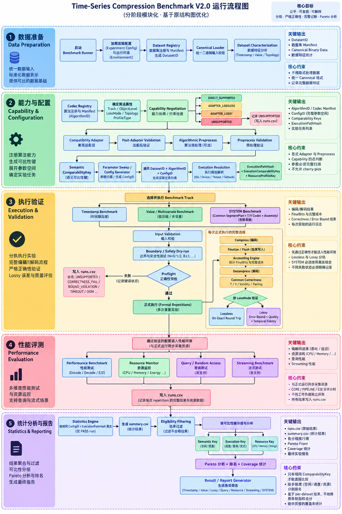

这个 Benchmark 的核心不是简单执行：

```text
Dataset -> Compress -> Decompress -> Ratio / Speed
```

而是构建一条可审计的证据链：

```text
数据身份与语义
  -> 算法能力和适配方式
  -> 安全、正确性与误差验证
  -> 同一次正式实验中的性能和资源观测
  -> 只对可比较结果进行统计与报告
```

五层分别回答五个问题：

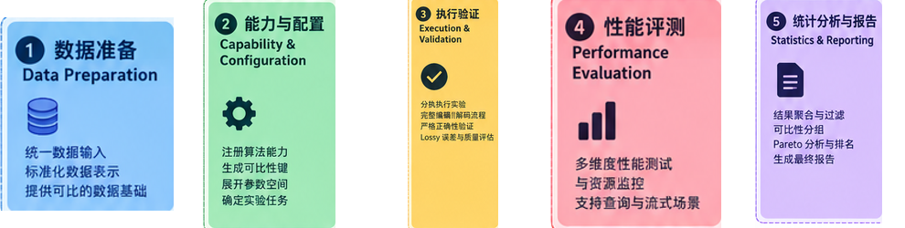

| 层级 | 回答的问题 | 最终责任 |
|---|---|---|
| 1. 数据准备 | 测试的到底是什么数据？ | 固定数据身份、逻辑语义和可比较分母 |
| 2. 能力与配置 | 这个算法能否直接处理这份数据？实际怎么运行？ | 防止隐藏转换、隐藏回退和参数挑选 |
| 3. 执行验证 | 这次压缩是否安全、正确、满足误差合同？ | 不让错误结果进入性能与排名 |
| 4. 性能评测 | 正确结果的速度、内存、能耗和查询能力如何？ | 保存同一次实验的完整原始观测 |
| 5. 统计与报告 | 哪些结果可以互相比较，如何汇总？ | 过滤不可比结果，公布 Coverage、Pareto 和报告 |

### 1.1 三条贯穿全流程的原则

1. **没有隐藏操作**：cast、transpose、排序、补值、量化、padding、fallback 都必须显式记录。
2. **先证明正确，再谈性能**：边界、安全、正确性或误差界未通过，不产生可参与统计的性能结果。
3. **只比较真正可比的结果**：语义相同是第一层条件；执行路径相同才能比较速度；资源采集范围相同才能比较资源。

---

## 2. 总体工程形态

```text
用户配置
   |
   v
Python Benchmark 控制面
   ├─ 数据登记、Canonical Loader、数据画像
   ├─ 算法登记、能力协商、任务展开
   ├─ Preflight、正式重复、正确性和计费
   ├─ 时间、CPU、内存、I/O、能耗采集
   └─ 原始结果、统计过滤、报告
   |
   +---- Python Adapter --------> Python 算法源码
   +---- C ABI / Python 扩展 ---> C/C++/Zig/Rust 源码构建产物
   +---- 受控子进程 -----------> CLI、Java、Go、旧 Python 环境
   +---- System Adapter --------> ClickHouse、Prometheus、Timescale、TsFile
   +---- Device Adapter --------> GPU、FPGA、QAT
```

Python 是当前的控制面和规范执行层，不要求所有算法重写成 Python。算法仍使用原始源码，通过合适的 Adapter 被 Python 驱动。

未来增加 C/C++ Runner 时，不再发明一套标准，而是继续使用相同的：

- Dataset/Algorithm/Config/Execution ID；
- JSON Schema 和状态码；
- 正确性、误差与 FinalBits 合同；
- `runs.csv`、`summary.csv` 和统计规则；
- 跨语言 Golden Fixtures。

---

## 3. 第一层：数据准备 Data Preparation

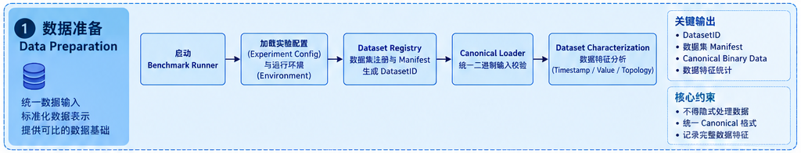

### 3.1 图中位置和目的

这是原图最上方的蓝色层。它负责把“一个数据文件”变成“具有稳定身份、明确语义和统一物理表示的 Benchmark 数据对象”。

这一层解决的问题是：两次实验是否真的用了同一份数据，以及压缩率分母是否基于同一份 Canonical 数据。

### 3.2 流程

| 图中步骤 | 做什么 | 为什么必须有 |
|---|---|---|
| 启动 Benchmark Runner | 创建 RunSet、冻结配置、检查输出目录和恢复状态 | 防止覆盖旧结果，并允许中断恢复 |
| 加载 Experiment Config | 读取实验配置和本机环境 | 确定数据、算法、参数、线程、计时和资源策略 |
| Dataset Registry | 校验数据文件、Manifest 和 hash，生成 DatasetID | 数据内容变化后必须成为新数据集身份 |
| Canonical Loader | 生成统一 T、V、validity、shape 和物理描述 | 让不同算法面对同一逻辑输入 |
| Dataset Characterization | 统计时间戳、数值和拓扑特征 | 解释某算法为什么在某类数据上表现不同 |

### 3.3 核心约束

- CSV/NPZ 文件大小不是统一 RawBits 分母；分母来自 Canonical 数据。
- 时间戳和数值分开建模：`T`、`V`、`validity`、`topology` 都是独立语义。
- 不允许 Loader 暗中排序、补空、去重、插值、重采样或统一 dtype。
- dtype、日期解析、时区、shape、axis、null 规则必须来自 Dataset Manifest。
- PEMS 的三维结构不能静默 flatten；没有时间戳的 NPZ 不能由 Loader 自行猜一个时间轴。
- 数据画像是只读分析，不能把“清洗后数据”反向替换 Benchmark 输入。

### 3.4 当前项目中的数据情况

当前项目已有 13 个真实数据文件：ETT、PEMS、electricity、exchange rate、illness、traffic 和 weather。它们适合做真实规模测试，但不能覆盖所有边界情况，因此还必须建立小型合成数据：

- N=0/1/2、块边界 B±1；
- 重复、乱序、负 delta、大 gap；
- ±0、subnormal、Inf、不同 NaN payload；
- 整数极值、不可压缩数据和压缩后扩张；
- heterogeneous dtype、validity、ragged 和异步实体。

### 3.5 第一层产出

```text
DatasetID
DatasetManifest
Canonical Binary Data + hash
Logical / Physical View Descriptor
Dataset Characterization
```

### 3.6 工程落点

```text
registry/datasets/
src/tscompbench/datasets/registry.py
src/tscompbench/datasets/loaders/
src/tscompbench/datasets/canonical.py
src/tscompbench/datasets/characterize.py
fixtures/datasets/
```

### 3.7 通过标准

- 同一文件和同一 Manifest 重复加载得到相同 DatasetID 与 canonical hash。
- 任何数据转换都有配置和记录。
- C/C++ 端可以读取小型 Canonical Golden Fixture。
- 原始数据只读，数据画像不修改输入。

---

## 4. 第二层：能力与配置 Capability & Configuration

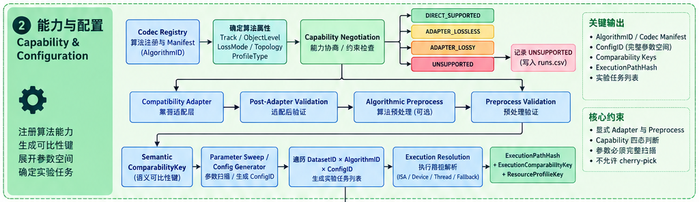

### 4.1 图中位置和目的

这是绿色层，也是整个系统最关键的“公平性控制层”。它不直接测速度，而是决定：

- 算法是什么层级和类型；
- 能否处理当前数据；
- 是否需要适配或有损转换；
- 哪些参数点要运行；
- 最终实际执行的是哪个 binary、ISA、设备和线程路径。

### 4.2 Codec Registry 与算法属性

每个算法先登记，再运行。登记信息至少包括：

- `AlgorithmID`、源码仓库、commit、license 和构建产物 hash；
- Timestamp、Value 或 SYSTEM Track；
- P0 primitive、P1 standalone、P2 pipeline 或 P3 system；
- 支持的 dtype、shape、layout、endianness、alignment 和最大长度；
- Lossless、error-bounded、rate-controlled 或 summary-only；
- block、window、state、reset、Finalize、dictionary、model 和 index；
- ISA、device、threading、fallback、query 和 streaming 能力。

一个源码仓库可能登记多个算法；多个逻辑条目也可能共享同一仓库。不能按文件夹数量推断可运行算法数量。

### 4.3 能力协商四态

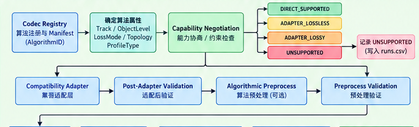

| 状态 | 含义 | 后续动作 |
|---|---|---|
| `DIRECT_SUPPORTED` | Canonical 数据可以直接输入 | 直接进入执行准备 |
| `ADAPTER_LOSSLESS` | 需要无损布局/表示适配 | 显式适配，并在 PIPELINE/E2E 计入成本 |
| `ADAPTER_LOSSY` | 需要量化或其他有损转换 | 只能路由到有损 Track |
| `UNSUPPORTED` | 当前数据、环境或请求不被支持 | 不调用算法，原因写入 `runs.csv` |

允许的无损适配可以包括 transpose、stride materialization、alignment copy、exact widening、endianness conversion 和 safe-overread padding，但每项都必须记录前后描述、copy bytes、额外内存和计时范围。

排序、插值、丢 null 或降低精度不能伪装成无损 Adapter。

### 4.4 Adapter 后仍需独立验证

适配器不能自己证明自己正确。`Post-Adapter Validation` 要验证：

- logical content 未变；
- shape、channel、validity、T/V pairing 未变；
- padding 没有进入 RawBits；
- 输入未被算法修改；
- adapter 的 reverse mapping 可恢复原逻辑对象。

### 4.5 Algorithmic Preprocess

Delta、DoubleDelta、ZigZag、FOR、量化、PCA、dictionary training 等属于算法管线步骤，不能隐藏在 wrapper 内。

预处理分为：

```text
NONE
LOSSLESS_LAYOUT
LOSSLESS_SEMANTIC
LOSSY_PREPROCESS
TRAINING_LEARNED
```

例如 ClickHouse Delta 是 preprocessor，不应被当成完整自包含 codec；Sprintz 对 float 做 8/16 bit 量化时应进入有损 Track。

### 4.6 比较键、参数和执行路径

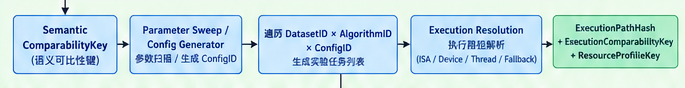

流程为：

```text
SemanticComparabilityKey
  -> Parameter Sweep / ConfigID
  -> DatasetID × AlgorithmID × ConfigID
  -> Execution Resolution
  -> ExecutionPathHash + ExecutionComparabilityKey + ResourceProfileKey
```

三个比较键是逐级收紧关系：

1. `SemanticComparabilityKey`：空间和质量是否可比。
2. `ExecutionComparabilityKey`：在语义一致基础上，速度是否可比。
3. `ResourceProfileKey`：在执行一致基础上，资源是否可比。

参数扫描必须保留全部候选点，默认值也必须写入 ConfigID。禁止运行后只挑某算法最好看的参数。

### 4.7 Execution Resolution

框架必须记录实际路径，而不是只记录用户请求：

- 实际加载的 binary 和动态库；
- requested/actual ISA、vector lanes 和 tail path；
- CPU affinity、线程、隐藏 OMP/BLAS/MKL/TBB 线程；
- device、driver、runtime、transfer 和 sync；
- fallback、adapter、worker 环境和 allocation/cache policy。

请求 AVX-512 但机器只有 AVX2 时，应写 `ISA_UNSUPPORTED`；如果允许 scalar fallback，则结果可以通过，但必须进入另一个 ExecutionPathHash。

### 4.8 第二层产出

```text
AlgorithmID / CodecManifest / SourceArtifactID
CompatibilityPlan
ConfigID
TaskID 列表
ExecutionResolution / ExecutionPathHash
Semantic / Execution / Resource comparability keys
```

### 4.9 通过标准

- 每个算法先完成源码、构建、许可证和能力登记。
- Adapter 与 Algorithmic Preprocess 都可观察、可计时、可验证。
- 不支持的任务也有结构化结果，不能从任务表中消失。
- 实际 ISA、设备、线程和 fallback 有运行时证据。

---

## 5. 第三层：执行验证 Execution & Validation

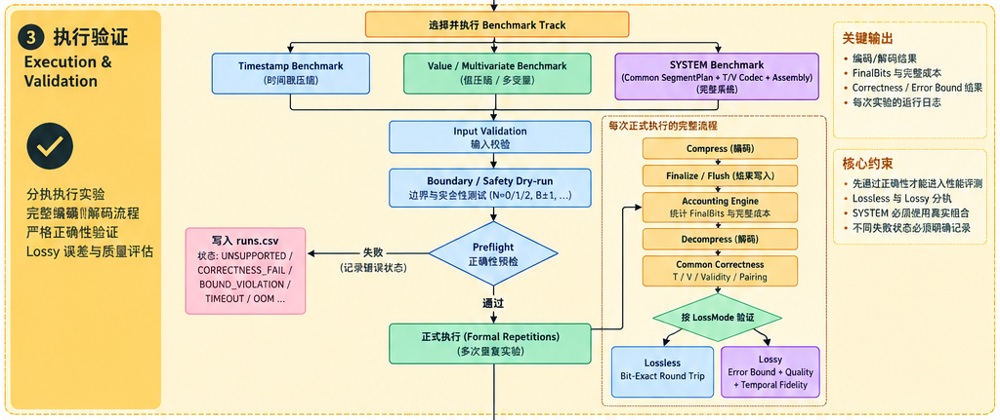

### 5.1 图中位置和目的

这是黄色层，负责给每次正式 Benchmark 建立正确性资格。它先选择 Track，再做输入、边界和安全预检。只有通过 Preflight 的任务才能进行正式重复。

### 5.2 Track 路由与 Preflight

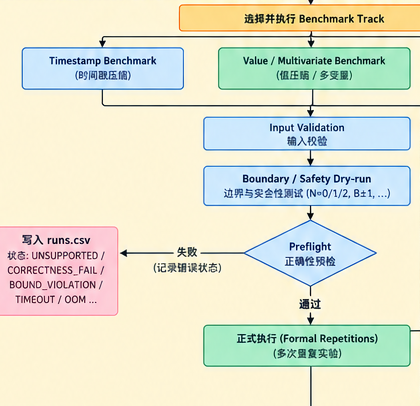

三种 Track：

| Track | 被压对象 | 约束 |
|---|---|---|
| Timestamp | T | V 不进入算法输入；时间单位、顺序、epoch 必须保持 |
| Value / Multivariate | V | T 仅可用于有损 temporal metrics 的对齐依据 |
| SYSTEM | T + V + validity + shared metadata + assembly | 必须使用共同 SegmentPlan，形成真实可解码系统流 |

Prometheus XOR2 等使用 T/V 联合控制位的算法属于 SYSTEM + JOINT_CODEWORD，不能强行拆成 TimestampBits 和 ValueBits。

Preflight 顺序：

```text
Input Validation
  -> Boundary / Safety Dry-run
  -> Preflight Gate
     ├─ 失败：写入 runs.csv，停止正式测量
     └─ 通过：进入 Formal Repetitions
```

Preflight 重点覆盖：N=0/1/2、B±1、window±1、特殊浮点、整数溢出、重复/乱序时间戳、不可压缩输入、最小 output capacity、canary、尾块、空 Finalize 和 reset。

Native 算法还要使用 ASan/UBSan 或 guard-page fixture 验证越界访问。

### 5.3 一次正式重复的完整生命周期

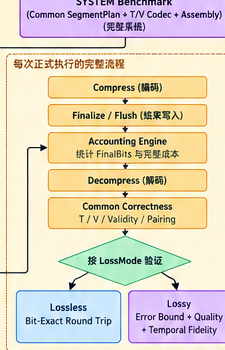

```text
创建独立上下文
  -> 准备输入和显式适配
  -> Compress
  -> Finalize / Flush
  -> Accounting Engine
  -> Decompress
  -> Common Correctness
  -> LossMode Validation
  -> 写入本次原始结果
```

不能只调用 `compress()` 就读取 buffer 大小。LZ4 frame footer、Zstd end、TsFile flush 和 bitstream 尾位都必须完成后，才能计算最终大小。

### 5.4 FinalBits

统一压缩大小定义：

```text
FinalBits = SerializedBits + ExternalSideInformationBits
```

需要计入的内容包括：T、V、shared bits、metadata、validity、dictionary、model、index、checkpoint、checksum、padding、container，以及解码所需但在 stream 外提供的 side information。

禁止行为：

- 用 output buffer capacity 当压缩大小；
- 用内存对象大小当序列化大小；
- 对每个 component 单独 byte rounding；
- 对不可分离的 T/V shared bits 做 50/50 分摊；
- 忽略模型、字典、索引或 header。

### 5.5 正确性与有损验证

Common Correctness 按固定顺序检查：

1. length、shape；
2. Timestamp、顺序、单位；
3. integer exact；
4. float IEEE bit exact；
5. validity；
6. channel/entity order；
7. T/V pairing；
8. sparse rebuild protocol；
9. determinism；
10. input immutability 和 memory/API safety。

Lossless 必须 bit-exact。Lossy 必须先检查声明的原始误差界，越界即 `BOUND_VIOLATION`；MAE、RMSE、PSNR 等只是质量描述，不能替代误差界。

Temporal Fidelity 是有损时序画像的 SHOULD 指标，不是所有有损算法的通用硬门禁。

### 5.6 失败状态

常见状态包括：

```text
UNSUPPORTED / ISA_UNSUPPORTED / BUILD_UNAVAILABLE
HARNESS_CAPACITY_ERROR / MEMORY_SAFETY_FAIL
CORRECTNESS_FAIL / BOUND_VIOLATION / NONDETERMINISTIC
OOM / TIMEOUT / CRASHED / RESOURCE_PRESSURE
```

失败同样是 Benchmark 结果，必须记录，而不是跳过。

### 5.7 第三层产出

- Preflight 资格与失败证据；
- 每个 repetition 的压缩、Finalize、计费、解压和验证结果；
- bitstream 或 hash；
- correctness、quality、first-failure stage；
- 与同一 RunID 关联的原始性能和资源记录。

### 5.8 通过标准

- 第 3 层和第 4 层使用同一次 Formal Repetition。
- Finalize 后再计费。
- Lossless、Lossy 和 SYSTEM 使用各自真实验证合同。
- 未通过 Preflight 的任务不会产生可排名性能数据。

---

## 6. 第四层：性能评测 Performance Evaluation

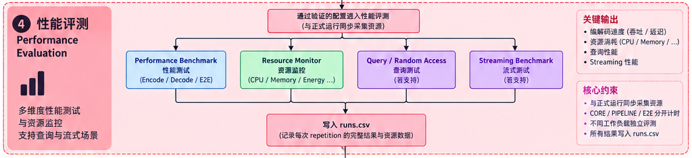

### 6.1 图中位置和目的

这是粉色层。它不重新执行一遍独立实验，而是在第三层的正式重复中同步采集速度、资源、查询和流式指标。

### 6.2 四类观测

| 图中模块 | 观测内容 | 主要约束 |
|---|---|---|
| Performance Benchmark | Encode、Decode、E2E | 明确 CORE/PIPELINE/E2E 范围 |
| Resource Monitor | CPU、memory、I/O、counter、energy | 明确 PROCESS/cgroup/device/system scope |
| Query / Random Access | point/range latency、amplification | 统一 seed、查询长度和列投影 |
| Streaming Benchmark | first-output、item/block latency、state | 必须是真实在线能力，不能只是 batch 分块调用 |

### 6.3 时间范围

- **CORE**：只看算法内核。
- **PIPELINE**：包括显式 Adapter、Preprocess、Codec、Finalize 和逆适配。
- **E2E**：包括约定的输入、输出、进程、I/O 或设备传输。

Python/FFI copy、NumPy contiguous conversion、进程启动、模型加载和 GPU transfer 是否计入，必须由范围说明，不能在算法之间采用不同边界。

### 6.4 重复和统计前置要求

- warmup 至少 3 次且累计至少 0.5 秒；
- 正式重复至少 10 次；
- 太快的 kernel 在一次 repetition 内循环到足够时长；
- 主榜默认单线程，隐藏线程池也计入总线程预算；
- 保存每次原始值，不能只保留最快值或平均值；
- context 是否复用、allocation 是否计时、cache/GC/JIT policy 必须固定。

### 6.5 资源测量

首版至少记录 wall/user/system time、core-seconds、RSS 增量峰值、I/O、page faults 和线程数。perf counter 和 energy 可用时再启用；不可用必须写 N/A 与原因，不能填 0。

当前机器为 Intel i5-13400F，支持 AVX2、没有 AVX-512，且 P/E core 异构。正式 CPU 性能需要固定并校准 CPU 集；GPU driver 当前不可用，因此 GPU Task 应明确 UNSUPPORTED。

### 6.6 Query 与 Streaming

统一 Query workload 使用固定 seed，支持点查和长度为 1、16、100、1000、full-block 的范围查询；MTS 还要测不同列投影。输出 p50/p95/p99、read amplification 和 decode amplification。

Streaming 记录 first-output latency、steady-state latency、lookahead、buffer/state、checkpoint 和 reset。只有算法 manifest 声明并验证真实 streaming 能力时才运行。

### 6.7 第四层产出

```text
每次 Encode / Decode / E2E 原始时间
CPU / Memory / I/O / Counter / Energy
Query latency 与 amplification
Streaming latency 与 state
TimingScope / ResourceScope / Thread / ISA / Device
```

### 6.8 通过标准

- 每个性能观测可关联到同一 RunID 的正确性和 FinalBits。
- 不使用 fastest-only 作为主统计。
- CORE、PIPELINE、E2E 的边界清楚。
- Query、Streaming 和 Hardware 不支持时显式记录 Coverage。

---

## 7. 第五层：统计分析与报告 Statistics & Reporting

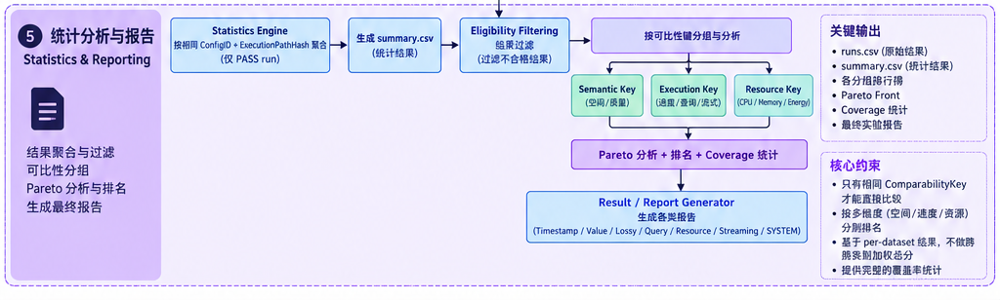

### 7.1 图中位置和目的

这是紫色层。它只处理已产生的原始结果，不再调用算法，也不能重写正确性。它负责回答：哪些结果能进入同一个比较，如何聚合，以及失败和不支持情况如何公开。

### 7.2 流程

```text
runs.csv 中的逐 repetition 原始记录
  -> Statistics Engine
  -> summary.csv
  -> Eligibility Filtering
  -> 按 Semantic / Execution / Resource keys 分组
  -> Pareto + Ranking + Coverage
  -> Result / Report Generator
```

### 7.3 Eligibility

只有满足以下条件的记录才能进入相应统计：

- `status == PASS`；
- correctness、bound 和 accounting 都通过；
- 必填字段不是 `UNSPECIFIED`；
- 同一 ConfigID 和 ExecutionPathHash；
- repetition 数和时长满足要求；
- 没有未隔离的 oversubscription 或 resource pressure。

每条被过滤结果都要保存原因，不能只显示“剩余多少条”。

### 7.4 汇总规则

- 先按 Dataset 统计，再进行跨数据集聚合。
- 每配置输出 median、P25、P75、mean、SD、CV 和 CI95。
- micro throughput 使用 `sum(bytes) / sum(time)`。
- micro compression 使用 `sum(FinalBits) / sum(RawBits)`。
- 不对吞吐率直接做算术平均，也不把峰值内存简单相加。

### 7.5 Pareto、排名和 Coverage

Pareto 可同时考虑 FinalBits、Encode/Decode speed、peak memory 和 quality，但只能在同一可比组内计算。

Coverage 的分母是实验开始前冻结的 Task Universe。UNSUPPORTED、TIMEOUT、OOM、CORRECTNESS_FAIL 等都要纳入 Coverage，不能静默删除。

以下对象不得放进同一总排名：

- Lossless 与 Lossy；
- Timestamp、Value 与 SYSTEM；
- P0 primitive 与 P3 system；
- UTS 与 MTS；
- CPU 与 GPU；
- 不同 SemanticComparabilityKey。

### 7.6 最终产物

| 文件 | 用途 |
|---|---|
| `runs.csv` | 每次 repetition 的原始结果 |
| `run_components.jsonl` | FinalBits、资源等复杂明细 |
| `summary.csv` | 同配置、同执行路径的统计结果 |
| `eligibility.csv` | 每条结果是否可进入某项分析及原因 |
| `coverage.csv` | 任务宇宙和各状态覆盖率 |
| `pareto.csv` | Pareto 前沿与被支配关系 |
| `report.json` | 机器可读最终报告 |
| Markdown / HTML | 面向用户的图表、方法、环境和异常说明 |

### 7.7 通过标准

- 任一报告点都能反查到 raw run、config、dataset、source、binary 和 environment。
- `summary.csv` 可完全从 `runs.csv` 重建。
- 只有同一 `ConfigID + ExecutionPathHash` 的 PASS 结果会被聚合。
- 排名同时展示 Eligibility、Coverage 和失败状态。

---

## 8. 五层之间如何连接

### 8.1 主数据链

```text
DatasetID
   + AlgorithmID
   + ConfigID
   + ProfileID
       -> TaskID
       -> ExecutionPathHash
       -> RunID × Repetition
       -> runs.csv
       -> summary / eligibility / coverage / pareto
       -> report
```

### 8.2 关键 ID 的职责

| ID / Key | 变化条件 | 用途 |
|---|---|---|
| DatasetID | 数据内容或数据语义变化 | 证明输入一致 |
| SourceArtifactID | 源码 commit、patch 或 source archive 变化 | 证明源码一致 |
| AlgorithmID | 算法身份或能力合同变化 | 区分逻辑算法 |
| ConfigID | 任一算法或管线参数变化 | 禁止不同参数混聚合 |
| ExecutionPathHash | binary、ISA、device、thread、fallback、环境变化 | 区分实际执行路径 |
| SemanticComparabilityKey | Track、Loss、对象层级、重建或语义变化 | 决定空间/质量可比性 |
| ExecutionComparabilityKey | TimingScope、ISA、thread 等变化 | 决定速度可比性 |
| ResourceProfileKey | 资源范围或采集方法变化 | 决定资源可比性 |

### 8.3 典型失败链

```text
数据不匹配
  -> Capability Negotiation = UNSUPPORTED
  -> 不调用算法
  -> runs.csv 写入原因
  -> Eligibility = false
  -> Coverage 仍保留该任务
```

```text
算法可运行但解码错误
  -> Preflight = CORRECTNESS_FAIL
  -> 不进入 Formal Repetitions
  -> 不产生可排名性能
  -> 报告显示失败范围和源码/配置
```

---

## 9. 当前源码资产如何进入这套架构

当前 `Compression_Source_Code/Source_Code` 中登记 221 个逻辑条目，映射到 72 个去重仓库。它们不能一次性按同一种方式接入。

### 9.1 推荐批次

| 批次 | 对象 | 目的 |
|---|---|---|
| 0 | identity、corrupt、timeout、OOM 等 Oracle | 先证明框架能正确接受和拒绝结果 |
| 1 | LZ4、Zstd、Snappy、Brotli | 打通 C/C++ 源码、C ABI、Finalize、FinalBits 和安全边界 |
| 2 | Delta/DoD/ZigZag、StreamVByte、FastPFOR、Simple8b | 建立 Timestamp primitive 与完整 pipeline |
| 3 | Gorilla、Chimp、Elf、ALP、Sprintz | 建立 Value UTS/MTS、float bits 和 coupling |
| 4 | Serf、SZ3、zfp、表示型算法 | 建立 error-bound、quality、native ND 和 temporal metrics |
| 5 | Prometheus、Timescale、TsFile、ClickHouse | 建立 SYSTEM、joint codeword、container 和 query |
| 6 | Learned、GPU、FPGA、QAT | 建立训练、模型、cold-start、device 和异构环境合同 |

### 9.2 为什么不直接复用现有 Benchmark 数字

现有项目各自采用不同的：

- 输入格式与分母；
- 最快值、平均值或固定循环；
- block 和 padding；
- allocation、copy、I/O 和 Finalize 范围；
- 正确性和 NaN 处理；
- 模型、header、index 与 side information 计费。

所以可以参考其 API、build、测试和 workload，但必须重新经过本项目的五层流程。上游 CSV 不能直接并入最终排名。

### 9.3 当前环境限制

- 主环境：`CompressBench14`，Python 3.14.5。
- 当前 CPU 支持 AVX2，不支持 AVX-512。
- 当前系统无 Zig，因此 TerseTS 需补 Toolchain 后才能正式构建。
- 当前 NVIDIA driver 不可用，GPU 项目先记录 UNSUPPORTED。
- 部分旧 Python/learned 项目可能不兼容 Python 3.14，应使用独立 worker env，不降低主 Runner。
- nvCOMP 当前本地 checkout 为归档指针，NNLCB 主要是结果，ModelarDB 当前不可直接获取；这些都不能标“已接入”。

---

## 10. 轻量实施路线图

### 阶段 A：先建立不会说谎的框架

建立 Schema、ID、状态机、append-only raw results、FinalBits ledger 和 Oracle adapters。

完成标志：错误、超时、OOM、不支持和正确结果都能被正确记录，统计只接受 PASS。

### 阶段 B：固定数据语义

为 13 个真实数据集建立 Manifest、Canonical Loader、Characterization 和边界 fixtures。

完成标志：同一数据重复加载 hash 相同，没有隐式 cast、flatten、排序或补值。

### 阶段 C：建立源码接入协议

建立 Source/Codec Registry、Capability Negotiation、Adapter SDK、C ABI、worker isolation 和 Execution Resolution。

完成标志：direct、lossless adapter、lossy adapter、unsupported 四种路径都有测试。

### 阶段 D：完成第一个真实源码闭环

优先 LZ4 frame，然后 Zstd。完整经过五层并产生报告。

完成标志：真实 stream 可解码、FinalBits 与物理长度闭合、10 次以上原始重复、CORE/PIPELINE/E2E 可区分。

### 阶段 E：扩展 Timestamp、Value、Lossy 和 SYSTEM

按 Batch 2–5 接入，并为每类建立专用正确性、误差和计费合同。

完成标志：不同 Track 和 ObjectLevel 不混榜，MTS 不用单列外推，joint stream 不强拆。

### 阶段 F：扩展 Learned 与 Hardware

增加训练、模型、seed、cold/steady 和 device profile。

完成标志：没有 test leakage，model bits/time 被计入，设备不可用时 Coverage 正确。

---

## 11. 架构师需要重点评审的十个问题

1. Canonical 数据格式能否由 Python 与 C/C++ 无歧义读取？
2. Algorithm、Source、Adapter 和 Build 是否拥有独立身份？
3. 是否存在 Adapter 或 Preprocess 隐藏语义变化？
4. Actual ISA、device、thread 和 fallback 是否真的可观测？
5. Preflight 能否在正式计时前阻断错误和越界？
6. Finalize、model、dictionary、index、metadata 是否全部计费？
7. 第 3/4 层是否来自同一次 Formal Repetition？
8. `runs.csv` 是否逐 repetition、append-only、可恢复？
9. Semantic→Execution→Resource 的比较边界是否被严格执行？
10. 报告能否公开 UNSUPPORTED、失败和 Coverage，而不仅是成功者排名？

---

## 12. 用户如何使用最终系统

用户只需要提供或选择：

- 数据集 Manifest；
- 算法集合；
- Timestamp、Value 或 SYSTEM Track；
- Lossless/Lossy profile；
- 参数扫描范围；
- Timing、Resource、Query、Streaming profile；
- 线程、设备、timeout 和资源上限。

系统负责：

1. 校验并冻结输入；
2. 解释哪些算法直接支持、需要适配或不支持；
3. 展开完整任务空间；
4. 先执行边界、安全和正确性预检；
5. 对通过任务进行正式重复；
6. 保存原始观测；
7. 只对可比较结果统计；
8. 输出报告和完整追溯信息。

用户看到的不应只有“算法 A 比算法 B 快”，还应看到：

```text
在哪个数据语义下？
用了什么参数？
实际走了什么 ISA/设备/线程路径？
是否包含 Adapter、Finalize、模型和索引？
正确性或误差合同是否通过？
多少任务不支持或失败？
两项结果为什么具备可比资格？
```

---

## 13. 文档边界

本轻量计划用于理解架构和评审流程，不替代详细工程合同。以下内容应回到[工程实施总计划](./TimeSeries_Compression_Benchmark_V2_工程实施总计划.md)查看：

- 完整目录树与模块职责；
- 所有字段、状态码和 ID 生成细节；
- 221 个逻辑算法资产及 72 个源码仓库审计；
- 每批算法的源码证据和特殊风险；
- 完整测试矩阵、风险登记、Phase 0–10 和验收清单。

本文件中的裁切图均来自原始流程图，只做确定性裁切或拼接，没有重绘文字、改变箭头或添加新的流程节点。

