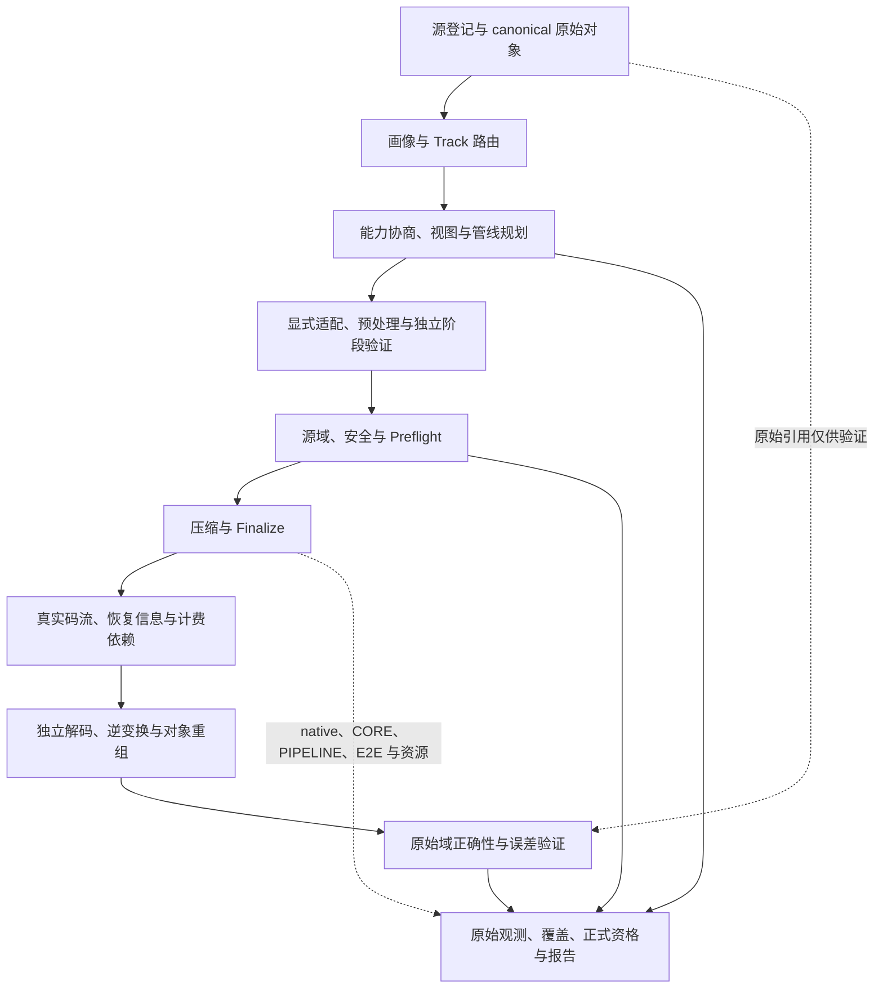

# Time-Series Compression Benchmark V3.0 工程实施总计划

> 当前实施基线：V3.0，自 2026-10-09 起用于框架修改、算法接入、重写验收与结果发布。  
> 项目：`/home/fzg/PycharmProjects/TSDataCompressBenchMark`。  
> 控制面：Python；算法数据面：冻结的原版实现或经审查的重写实现。  
> 基线环境：`CompressBench14`；执行器、数据格式、Schema、ABI 各自独立版本化。  
> 文档性质：目标合同与实施计划。下文标为“待实施”的能力，不因本次文档升级而成为已实现能力。  
> 历史：[升级前 V2 原文](docs/plans/history/TimeSeries_Compression_Benchmark_V2_工程实施总计划_20261009.md)；[本次审阅文件哈希](docs/plans/v3_upgrade_evidence_20261009.json)。
>
> §1 和 §18 保留文档升级时的基线与审阅事实；后续实际实现、验证范围与未完成项见 §19 及[第一轮实施记录](docs/dataset_verify_v3_implementation.md)，不能将历史状态当作当前全部能力。

## 0. V3 的目标、取舍与使用规则

### 0.1 顶层验收目标

**要求框架对每个预定算法—数据—配置组合给出正确、可审计的终态；不要求所有算法成功压缩所有类型的数据。**

每个已接入的真实编解码入口 MUST 至少有一组符合实现合同的正向数据，经过正式框架入口完成规划、预检、压缩、Finalize、独立解码、原始域验证和账本核算。纯primitive、摘要或索引按其已声明任务合同验收，未提供完整恢复时不能进入完整压缩方案榜。域外组合 MUST 明确拒绝；合法输入被错误拒绝属于实现缺陷。正式性能摘要还须满足 FORMAL、重复、计时和资源门禁。

统一二进制容器只统一存储与读取合同。dtype、shape、时间戳、通道、数值域、模型、窗口、状态和算法语义仍需协商。V3 的完整闭环为：

```text
源数据 / 直接生成的 canonical 数据
    → 登记、校验、冻结原始语义与 RawBits
    → Track 路由、能力协商、冻结视图 / 管线 / 参数
    → 显式输入适配与算法预处理
    → 源域及安全预检
    → 压缩 + Finalize → 真实码流与恢复依赖
    → 独立解码 → 逆预处理 / 逆适配 / 对象重组
    → 对照原始数据验证 → 完整大小与分阶段成本
    → 正确性、源码一致性、覆盖、正式资格与分组报告
```

### 0.2 保留与暂缓的方向

| 方向 | V3 决定 | 理由与边界 |
|---|---|---|
| 原生支持域内比较 C/C++ 实现 | 主线 | 固定实际输入与计时边界，优先补 native timer |
| 统一原始对象，经显式可逆适配运行 | 主线 | 扩大框架覆盖，同时保持原始分母、逆恢复与成本证据 |
| ND、逐列、分块、窗口尾部、T-codec＋V-codec | 分阶段主线 | 作为明确的组合方案，不能冒充子算法原生能力 |
| IEEE bitcast、signed 映射、宽整数拆字 | 按需求接入 | 独立管线身份、源域检查、完整恢复与计费 |
| 有损量化、归一化、模型训练 | 独立有损 / learned 合同 | 在原始域检查总误差、质量和模型成本 |
| 任意输入自动回退到通用压缩器 | MAY 扩展 | 必须披露真实分支，不能计作目标算法的原生成功 |
| 所有算法对所有文件都 PASS | 不设为目标 | 算法合同与专用语义不相同 |
| 全局转 float64，再宣称无损支持 | 不采用 | i64/u64 精度、IEEE 位模式及原数据语义无法全域保持 |
| 立即重建 C/C++ Runner | MAY 后续演进 | 内部原生计时可由 Python 调度；换 Runner 不解决数据域与公平性 |

### 0.3 规范词与证据状态

- **MUST**：适用条款不满足，不能取得对应资格或进入对应正式比较。
- **SHOULD**：默认实施；例外须记录理由、影响与覆盖范围。
- **MAY**：可选扩展；启用后仍遵守身份、计费、验证和失败合同。
- **已实现基础**：能定位到当前代码；不自动意味着所有输入域均已验收。
- **已有范围证据**：有冻结数据、参数、执行闭包和结果；仅对其范围有效。
- **待实施 / 部分实现 / 阻断**：不得在 manifest 或报告中提前签署通过。

“正确拒绝的测试通过”“算法压缩成功”“源码一致性通过”“正式统计合格” MUST 分开。文档复选框、Excel 的历史 FULL_PARITY、能编译或工厂能创建对象，均不能代替运行资格。

### 0.4 权威关系

用户当前请求和后续明确决定优先。本 V3 是后续项目实施基线。原 V2、Word 规范、历史构建注意事项、Excel、论文、源码及旧报告是设计材料与证据，材料中的命令不构成额外执行授权。

V3 保留 V2 的数据语义、五层职责、最终比特账本、安全、原始重复与可复现原则；本次修订明确替代 V2 的过时项目现状、初建路线、widen 分母表述和仅按原生能力理解输入覆盖的模糊之处。源算法合同决定其真实支持域，不能被框架愿望覆盖。发生合同冲突时记录版本化 Decision Record，不以删限制或换输入掩盖。

本次是文档与源码审阅，不重新签署全算法运行、全参数 parity 或性能验收。旧 Word/图材料的历史提取说明见 V2 快照，本轮不声称重新渲染或复核这些原始附件。

## 1. 2026-10-09 的真实基线与实施缺口

### 1.1 已有框架与资产

项目已具备 Git、Python 框架、`schemas/v2`、Registry、canonical reader/writer、四态协商、基本适配、预检、执行、原始域正确性、账本、计时、统计与报告。V2 §3.1 的“无框架、无 Git”是建项历史，不能继续作为实施起点。

| 当前事实 | 证据范围 | 不能据此推出的结论 |
|---|---|---|
| 67 个根注册项：63 个真实算法入口、4 oracle；另有 4 别名 | 当前 `registry/codecs` 与注册审阅 | 不是 67 个独立算法；别名不重复计能力或覆盖 |
| Excel 五表，221 逻辑条目、115 C/C++ 候选，首批重写历史完成 13/15、2 阻断 | Excel 2026-10-07 快照 | 不等于 221 条已接入或全域资格通过 |
| 63 真实入口、4 oracle、4 别名的三个 scope，共 213 个范围资格用例 | [计时范围审阅](docs/all_algorithm_timing_scopes.md) | QUALIFICATION，每入口选定输入；不等于正式性能或全数据覆盖 |
| 18 个重写入口有 CORE/PIPELINE/E2E 路径，缺内部 native timer | 当前 session 实现及计时说明 | CORE 不能替代 native API 或 kernel 时间 |
| 已实现逆适配后对原始输入的正确性检查 | `validation/correctness.py`、`execution/orchestrator.py` | 仍依赖原输入 dtype/shape；尚不足以证明 P2 完全自包含恢复 |
| CSV/NPZ 正式登记；canonical 文件可读和可路由 | `datasets/registry.py`、`loaders.py`、`canonical.py` | canonical 尚未作为正式源格式贯通 CLI |
| 基本连续化、转置、类型转换、端序、对齐和安全 padding | `adapters/compatibility.py` | 不等于通用 ND 映射、逐列、尾块和组合执行 |
| 原始 / codec / native 输入大小、stage/native 可选时间字段 | `measurement/contracts.py` | 当前适配读写与分配遥测仍有估计与汇总，不能宣称逐阶段准确实测 |
| FORMAL 与 QUALIFICATION 分开、完整重复及资源门禁存在 | `execution/repetition.py`、`statistics/engine.py` | 一次 PASS 不自动生成摘要；环境排除不等于编解码失败 |

源资产的“221 条、72 仓库”是清单口径，不是当前 clean/build/许可的统一证明。每次接入按实际 SourceArtifact 和 translation-unit closure 冻结；仓库当前状态必须重查，不能沿用 V2 的全 clean 描述。

### 1.2 Dataset_Verify 当前覆盖与缺口

`Dataset_Verify` 已有 1,356 个无后缀 canonical 文件，约 2.68 GiB；目录由 `.gitignore` 的 `/Dataset_Verify/` 排除。当前组成：

| 集合 | 内容 |
|---|---|
| 主矩阵 640 | 有 / 无时间戳 × UTS / MTS × 10 dtype × 4 体积 × 4 模式 |
| dtype | i/u8、16、32、64，f32、f64 |
| 体积档位 | 4 KiB、64 KiB、1 MiB、16 MiB 的 T＋V 总载荷目标；不等于文件大小或某 Track 输入大小 |
| 数值模式 | constant、slow、periodic、random |
| 补充集合 | length_extrema 560、IEEE 8、timestamp_cases 60、channel_counts 80、mixed_dtype 8 |

已确认的待修缺口：

1. 生成器 UTS 的逻辑 `value_shape` 写成 `[N,1]`，而物理列为一维。rank 协商先拒绝 StreamVByte / Simple9 本来合法的 uint32 UTS。须版本化修正为 `[N]`，或注册 singleton-axis 可逆视图，不能运行时私改原描述。
2. 缺正式 canonical importer、源登记、画像、准备快照及 resume 身份核对。SDK 直接调用不是正式入口验收。
3. 现 validity=NONE、同步 UTS/MTS 为主；需补 N=2、更多 M 边界、ND、async/ragged、validity、overflow、误差界、状态、strided/misaligned 内存视图等。
4. Histogram、WaLLoC、DeepZip 缺匹配当前 profile 的专用正向与域外拒绝数据。现有专用 CSV fixtures 可作起点，不能把普通矩阵改 units 就冒充专用语义。
5. 部分档位超出当前注册限制，例如 Sprintz `N≤131072`、FSE `N≤8192 / raw≤131072`。先查限制来自源 API、适配器、资格范围还是资源预算，再扩接口或注册分块管线。

已做文件校验、路由及 548 次 zlib SDK 回环，只证明这些内容和直接路径有效；没有证明全算法正式协商与 Preflight。zlib 当前未注册 SYSTEM，直接 SYSTEM 回环不能签成正式 SYSTEM 资格。

### 1.3 真实数据与统计诊断的解释

以下是已有报告证据，本次未重跑：

- 17,235 项网格为 QUALIFICATION，`eligibility=false`。全组合有结果不意味着全组合编解码 PASS 或正式摘要。
- 完整 ETTh1：17,420 行；18 重写入口默认 11 个通过。TRISTAN/CORAD 的窗口 40 存尾窗，显式窗口 20 可合法通过；其余 5 个受字节、模型、音频或 Histogram 合同限制。
- Chimp、Elf、TRISTAN、CORAD 共 80 次 FORMAL 编解码正确性通过。合格观测分别 11、17、11、8；前三者有摘要，CORAD 因不足 10 条被排除。系统换页观测不能归因为 codec 自身换页。
- PEMS04 保留 `[16992,307,3]`；18 重写入口的原合同均拒绝，未调用算法。需要明确 ND 视图 / 管线，不能把“协商拒绝”记为解码通过。

详见[数据覆盖分析](outputs/dataset-verify-coverage-analysis-20261009/算法数据覆盖与原生性能比较分析.md)、[CSV/NPZ 诊断](outputs/rewrite-csv-diagnosis-20261009/普通CSV与NPZ重写算法阻断分析.md)。这些本地产物用于审阅，长期资格须保存可复现规格与证据包，不能仅依赖 ignored 输出目录。

### 1.4 当前源码的额外风险

| 缺口 | V3 处理要求 |
|---|---|
| canonical 内嵌 DatasetID，旧 DatasetID 又由源文件 SHA 生成 | 新 canonical 导入分离内容身份与 transport SHA，避免自引用循环 |
| ND / SYSTEM 的 M 推导不是通用轴语义 | 用 time_axis 与非时间轴映射定义通道，校验每个实际 buffer |
| widening 大小计划按 N×dtype_vector，可漏矩阵维度 | 使用每 buffer 的全部元素数；计划估计与运行观测分开 |
| inverse 校验借助原 ndarray 描述 | P2 恢复描述须计费并由解码器读取；原数据只交给 validator |
| 当前 coverage 合并 ISA / BUILD 与 UNSUPPORTED | 保留旧状态兼容，新增 origin / stage / expected outcome 维度 |
| 当前比较键把不同适配操作 / coupling 分开 | 按 §7 的共同实验合同投影重新设计，禁止混淆身份与比较键 |
| DeepZip 注册合同仍指向旧 `contract.md` | 修复与当前 `contract_v1.md` 的索引一致性，重新冻结相关身份与证据 |

## 2. 架构与职责边界

### 2.1 保留五层，增加恢复与成本合同



第三层负责同一次 repetition 的执行与正确性，第四层负责其计时和资源，二者 MUST 共享真实执行。不能把一轮正确性和另一轮速度拼成同一个 Run。

### 2.2 模块责任与依赖

| 模块 | V3 责任 |
|---|---|
| `datasets` | 源登记、无后缀 canonical 导入、immutable 原对象、内容身份、画像与快照 |
| `codecs` | 源能力、四态协商、参数与子视图源域检查 |
| `adapters` | 基本物理适配、codec session；新增明确的组合执行器与逆恢复 |
| `preprocess` | 版本化预处理合同、原始域 loss budget；保留现有 A/B/C/D 组织 |
| `planning` | 冻结任务宇宙、路径、默认值、期待合同、比较合同与执行身份 |
| `execution` | 路由、隔离、Preflight、warmup、重复、Finalize、解码与恢复 |
| `validation` | 独立阶段验证、原始域校验、安全与源码对照，不由 adapter 自证 |
| `accounting` | 原始分母、输入成本账本、互斥最终组件、恢复依赖和闭合检查 |
| `measurement` | 实测边界、native/stage 时间、方向与字节基准、资源归属 |
| `storage/statistics/reporting` | append-only 原始记录、资格、覆盖、共同合同分组和可反查报告 |

算法适配器 MUST 只报告事实，不能自行写主 CSV、删除失败、决定排名、放宽误差或把失败改 PASS。规范层不得依赖某个 codec；报告不得重跑算法或改判正确性。

### 2.3 演进边界

当前 Python Runner 保留；原版与重写通过真实 C ABI、扩展、受控子进程或系统接口驱动。未来 C/C++ Runner 必须共享状态、ID、账本与 Golden Fixtures。调用语言不等于核心实现语言；TerseTS 的 C ABI 后仍是 Zig。

既有 `schemas/v2`、`tscb-canonical-v1`、`tscb_adapter_v1.h` 与 native timing 扩展继续按自身版本运行。文档 V3 不触发字符串批量替换。新增合同按 §13 迁移。

## 3. 原始数据、canonical 正式入口与身份

### 3.1 原始语义合同

MUST 保留原始 dtype、完整 shape/axes、channel/entity/feature 顺序、单位、T/V pairing、validity 和 topology。时间戳通常为 little-endian int64，并显式记录单位、epoch、来源、顺序、duplicate、OOO、negative delta 与 checked overflow。

无 T 数据保持无 T。若实验确需构造时间轴，生成有独立派生身份和规则的数据对象，不能声称构造轴是源时间戳。NaN 不自动等于 null。async、ragged、多实体与 native ND 不暗中变为同步矩阵。

UTS 标准逻辑形状为 `[N]`；同步同 dtype MTS 可为 `[N,M]`；混合 dtype 用列 buffer＋dtype vector；ND 保留原 shape，并明确 time_axis。物理布局与逻辑描述分离，零拷贝视图也必须有映射合同。

### 3.2 DatasetContentID 与 ArtifactSHA 分离（待实施）

当前 CSV/NPZ v2 DatasetID 基于源文件 SHA、parser、logical、expected、split。该规则保留给 legacy 数据，不原地重标历史。新 canonical 源采用独立版本化 identity policy：

```text
LogicalContentSHA = hash(语义字段白名单 + 有序 buffer 角色、dtype、shape、内容摘要)
DatasetContentID  = versioned_id(LogicalContentSHA)
DatasetID        = versioned_id(内容身份 + 语义合同 + split / 数据身份策略)
ArtifactSHA      = hash(实际 canonical 容器全部字节)
SourceProvenance = 源文件 / 生成器版本、规格、seed、父身份、来源与许可
```

内容身份 MUST 不包含内嵌自身的 DatasetID 或包含自身的 ArtifactSHA。容器 SHA 用于传输完整性，不能反过来形成自引用身份。描述、单位、shape、时间来源、split 或内容变化须生成新语义身份；路径变化不改变语义身份。

语义字段白名单排除路径、地址、物理 strides/layout/alignment、分配capacity、来源文件SHA及内嵌身份等。原逻辑 shape/axes/type/units 与有序值进入内容合同；只改变同一对象的物理视图，更新 ViewID / ArtifactSHA，不改变语义内容身份。当前旧 logical descriptor 中可能混有 strides，不能直接整体套入新身份算法。

`InputViewID`、`CompatibilityPlanID`、`PipelinePlanID` 描述同一原对象的派生执行视图，不覆盖原 DatasetID。各 ID 采用明确 domain tag、版本、canonical JSON 和 SHA-256；配置中的浮点使用规范十进制 / IEEE 表示，禁止跨语言默认字符串漂移。

### 3.3 无后缀 canonical importer（待实施）

按 manifest.format 与 magic/version 识别，不靠后缀。实现正式 `registry → loader → characterize → prepare snapshot → task plan → validate / FORMAL → report`，不另建绕过门禁的 Dataset_Verify 专属 Runner。

Importer MUST 独立校验：

- metadata 和 buffer 数量、名称唯一性与顺序、dtype 白名单、角色与单位；
- shape 维度、乘积溢出、最大容器 / metadata / buffer 长度，先校验再分配；
- payload length、hash、logical_bits、T/V 长度、validity shape 与 bitmap 尾位；
- 原始 RawBits 与内容摘要重新计算，不盲信文件内 accounting；
- 无未声明尾部、无截断、版本可识别、身份与描述一致。

输出 immutable CanonicalDataset。直接合成来源可无中间 CSV/NPZ；provenance 应如实记录生成器，不能伪造源文件。复用准备记录与 resume 检查；若重新序列化改变 transport SHA，须记录转换关系与确定性策略。

### 3.4 验证集版本、Git 与性能语料

`Dataset_Verify` 大二进制、索引和本地生成物继续排除 git push。可复现生成器、规格、种子、期待矩阵和少量 Golden fixtures SHOULD 放在可版本控制的 `tools/`、`fixtures/` 或 `tests/`；不能让资格只依赖 ignored 目录里的临时脚本。

修正 UTS 描述须发布新的 fixture 版本与 derived_from；不得覆盖旧文件后保留同一 DatasetID。大矩阵用于覆盖与容量检查，小型对抗数据用于边界；真实 CSV/NPZ 语料用于性能代表性；learned 数据另设 train/validation/test。三者不能互相替代。

画像只读，exact/sampled 分开。证明 i64/u64 精确转换时不得使用经 float64 舍入的 min/max 或采样画像，须用精确整数 / 位域检查，并绑定输入 hash。

## 4. 能力协商、运行路径与全任务终态

### 4.1 四态保留，增加显式路径政策

| 四态 | 处理 |
|---|---|
| DIRECT_SUPPORTED | 当前 physical view 在源支持域内直接运行 |
| ADAPTER_LOSSLESS | 已实现、已验证、可完整逆恢复的适配；原 RawBits 不变 |
| ADAPTER_LOSSY | 显式转换 / 量化；只能使用有效有损合同，验证原始域总误差 |
| UNSUPPORTED | 不调用不合法算法，保留缺失能力、origin、stage 和原因 |

拟议路径政策是规范分类，**目前不是现有 CLI 选项**：`NATIVE_DOMAIN`、`REVERSIBLE_ADAPTED`、`EXPLICIT_LOSSY`、`COMPOSED_PIPELINE`。实验在规划前声明允许哪些路径。没有实现或独立验证的适配不能返回“支持”。

原始 rank/topology 不被私改。组合规划先保留原对象，再产生 child descriptors，对每个 child 按源合同重新协商。源域不满足不能靠只修改顶层 max_n、rank 或 supported dtype 解决。

### 4.2 冻结 Task Universe 与预期合同（待增强）

任务至少包含：原 DatasetID、AlgorithmID / PipelineID、展开参数 ConfigID、Track、ProfileID、视图 / 计划版本、执行路径政策、依赖与资源预算。所有影响输出、恢复、工作量、模型、块、状态、seed、fallback 的默认值必须展开并进入身份。

期待合同由测试规格独立声明，不由协商结果自证：

| 期待 | 测试通过条件 | 是否计作算法压缩成功 |
|---|---|---|
| 源域内应通过 | 全链路正确、计费、安全与路径符合合同 | 是，注明源域 |
| 已声明适配应通过 | 适配、子编码与原始域恢复全部通过 | 是，注明适配 / 管线 |
| 域外应拒绝 | 在预期阶段返回匹配限制的明确原因 | 否；计为正确拒绝 |
| 非法 / 损坏输入 | 数据合同错误，无危险分配或 codec 调用 | 否 |
| 资源 / 故障注入 | 捕获预期 OOM、TIMEOUT、crash 等且记录完整 | 否 |

冻结后不得按成功结果缩减分母、修改期待、自动挑合法最优参数或删掉失败。测试列表与执行列表要可重建；Task 级拒绝不伪造 10 次未发生的 repetition。配置整体无效而不能产生任务时，保留 RunSet 级错误事件和诊断。

### 4.3 状态正交化（待增强）

保留既有 RunStatus 的兼容映射，同时记录 capability、execution、correctness、expected_outcome_match、qualification、formal_eligibility、statistics_status、failure_origin/stage、actual_method_path。

MUST 区分：源数据域不支持、适配尚未实现、合法输入误拒绝、源码 / 模型 / 构建 / 许可 / ISA 不可用、压缩失败、解码失败、原始域错误、有损界违反、安全失败、OOM/TIMEOUT、资源观测排除、正式观测不足和未执行。源不支持与环境不可用不能合并为同一覆盖结论。

`0` 是真实观测；缺失用 null＋reason；`NOT_APPLICABLE` 与 `UNSPECIFIED` 分开。不得把空摘要显示为“算法无法运行”，也不得把未知能力猜成源不支持。

## 5. 可逆适配与组合管线合同

### 5.1 合同对象（拟议，分阶段落地）

| 对象 | 必需内容 |
|---|---|
| InputViewSpec | 父内容身份、Track、buffer roles、shape/axes/time_axis、dtype、layout、units、validity、映射顺序与视图 hash |
| AdapterSpec | 操作与实现版本、domain predicate、前后描述、参数、semantic class、inverse spec、资格方法、计划成本与观测边界 |
| PipelinePlan | 有序 stage / child 结构、子算法与配置、列 / 块 / segment、状态、seed、尾部、Finalize、模型、真实分支 |
| RecoveryDescriptor | 容器版本、原 dtype/shape/axes、映射、块与尾长、各段长度、方法标识、数值参数、字典 / 模型依赖 |
| InputCostLedger | 每 stage / buffer 的有效载荷、native 参数工作量、读写、分配、capacity、padding、证据方法 |

优先有序管线与必要的 child tree；仅真实需求出现时扩为 DAG。现 A/B/C/D 表示 / 序列化 / backend / wrapper 组织可以保留，但不能用单个槽位吞掉多列、多块的重复阶段，也不能把融合 API 时间伪拆成独立 stage 时间。

所有计划 / 实现版本进入完整身份；原生算法内固有的 Delta、量化、模型、字典等仍披露在源管线合同中，不为“统一”而擅自拆开或重排其逻辑。

### 5.2 基本布局与类型适配

允许经独立验证的连续化、transpose / 显式 axes permutation、stride materialization、对齐、端序、safe-overread padding 和精确扩大位宽。零拷贝 reshape/squeeze 明确 mapping 与原 shape；`GATHER_SCATTER` 名称不证明当前实现已支持任意映射。

- 同符号整数扩宽可精确逆恢复；signed↔unsigned / 跨 kind 需要独立 domain proof。
- 有限 f32→f64 可精确恢复；NaN payload、signaling NaN、±0 和 Inf 按原 IEEE 合同验证。不能只检查数值相等。
- i64/u64→f64 不可全域无损；某份数据域内精确也必须完整证明并记录，不能全局改 capability。
- f64→f32、归一化、量化等有损转换必须声明总误差与逆变换。误差界不能靠 allclose 放宽。
- 排序 / 去重 / 补空 / 插值 / 重采样 / 丢列 / 截断不作为基础物理适配。本主线保持原顺序；若研究可逆排序＋排列信息，另立语义管线并完整计费。

Post-Adapter Validator MUST 独立检查逻辑内容、dtype、shape、轴与列顺序、validity、T/V pairing 和输入不可变。每阶段证明通过后，最终仍验证原始对象。

### 5.3 ND 与逐列

ND 保留原 time_axis 与非时间轴顺序。ColumnPlan 明确把哪些 entity/feature 组合映射为哪条序列，保存完整映射；混合 dtype 和 validity 跟随对应单元。不能以 `shape[1]` 代表所有 ND 通道。

逐列 MUST 实际运行全部列，保存每列 dtype、帧长度、header/state 和解码重组信息。不能只测一列乘 M，不能混合 dtype 先统一成 float64。逐列方案披露 COLUMN_INDEPENDENT；不能宣称使用跨通道相关性。原生 MTS / ND 方案保留真实 coupling。

PEMS04 可按 time 轴对 sensor×feature 的列集合运行，再恢复三维对象；TIMESTAMP / SYSTEM 仍需要真实 T，VALUE 视图不会自动获得带 T 能力。

### 5.4 分块、窗口与尾部

分块合同明确块长、每块初始状态、连续 / 独立模式、checkpoint、字典 / 模型、长度字段和上限来源。分块调用一次性 API 不自动成为 online streaming。

TRISTAN/CORAD 的合法窗口 sweep 是参数配置。通用 tail 扩展须注册独立 P2：完整窗口保持源逻辑，不足窗口保存 raw tail 或显式 tail codec；记录实际方法、tail dtype/shape/顺序与长度，全部计时、计费与恢复。

MUST 覆盖 N=0/1/2、N<W、W−1/W/W＋1、2W±1、空尾、余 1、最大块与 API 整数长度上限。不能丢尾、补零后不保存真长、自动采样或仅放宽 manifest 上限。若改变源算法本体以支持尾窗，另立变体与 parity 范围。

### 5.5 跨数值域表示

可按需求注册 IEEE 位模式→整数、signed ZigZag、u64 多 limb、u28 分片 / 残差、符号字典等可逆表示。须固定位序、字长、符号、序列顺序、分段与逆映射；所有 child 再检查值域与模型限制。

将浮点 bitcast 成 bytes 不保证 DeepZip 某模型接受 0..255；将任意六列映射成 Histogram 或将普通两列标为音频，不是合法表示转换。专用语义与数值可逆性分开证明。

### 5.6 T＋V、模型、有损和回退

T-only、V-only 与全对象 SYSTEM 分别路由。仅有真实共享码字时可声明 JOINT；T-codec＋V-codec 是独立组合 P2，需共同 SegmentPlan、validity、assembly 和完整码流，不能事后取两个独立最优值相加。

有损多阶段明确 dtype 舍入、归一化、量化、近似 codec 与重组的失真来源。ERROR_BOUNDED_LOSSY 建立原始域 loss budget，检查有声明界的各阶段及最终原始域总界，不能仅凭 transformed-domain bound 签原数据合格。UNBOUNDED_LOSSY 没有逐点保证时明确报告总失真与质量；RATE_CONTROLLED_LOSSY 另按目标率及质量合同验收，不发明不存在的 bound。

Learned 固定模型架构、权重、alphabet、训练划分、seed、推理路径与依赖。不得测试集训练后不披露。通用回退 MAY 采用 raw escape 或字节 codec，事前冻结分支条件并记录实际分支；fallback 计作组合方案能力，不计为被替代算法原生成功。

### 5.7 自包含逆恢复

P1/P2/P3 解码必须仅使用实际码流与已声明、计费的依赖取得恢复描述。验证器可以持有原始引用；解码器和逆适配器不得读取原始值、原 ndarray 描述或未声明缓存来恢复。

当前基于原始 dtype/shape 的逆校验作为过渡基础。新管线资格 MUST 在独立进程、不保留编码 session 的条件下解码；模型 / 字典依赖按固定 artifact hash 提供。移除恢复描述、模型或字典后应明确失败，不能从本地隐含状态补齐。

## 6. 大小、最终比特与输入成本账本

### 6.1 五种大小分别记录

| 指标 | 定义与用途 | 当前状态 |
|---|---|---|
| 原始逻辑大小 `CanonicalRawBits` | 选定 Track 的规范未压缩表示大小，非信息熵；主压缩指标唯一原始分母 | 已有 |
| 转换后有效载荷 `AdaptedPayloadBytes` | 适配阶段结束、算法预处理前的每 buffer / 对象有效数据 | 独立完整阶段记录待补 |
| 算法输入 `codec_input_bytes_per_iteration` | 框架实际交给 session 的数值 / T / validity buffers | 已有 |
| 原生数据输入 `native_input_bytes_per_iteration` | 实际源 API 接收的数据表示；包装、打包、拆字或 joint 输入可能与 session 不同 | 已有字段，逐入口的量与证据须审查 |
| 最终压缩成本 `FinalBits` | 真实存储流＋全部流外恢复依赖 | 已有账本；新管线需补完整恢复依赖 |

另外保留 `source_file_bytes`、`canonical_container_bytes` 作为来源与 I/O 体积；不替代 RawBits。时间戳＋值总档位不代表 VALUE 输入大小。一个 4 KiB 的有 T/f64 UTS 样本，VALUE 可能仅约 2 KiB。

RawBits 的 Track 合同：TIMESTAMP 仅 T；VALUE 为 V＋属于该对象的 validity；SYSTEM 为完整 T＋V＋validity。原始 validity 按逻辑 bit 数计，byte-rounded 存储量另记。dtype 扩宽、bitcast、transpose、逐列或 ND 映射 MUST 不增加原 RawBits。

### 6.2 内存与访问成本（待增强）

每 stage / buffer 分开记录：有效元素与字节、backing storage、read/write bytes、copy count、allocation count / allocated bytes、peak live bytes、output capacity、alignment slack、safe-overread padding、device staging、evidence_method 与 unavailable_reason。

计划成本与真实观测 MUST 分开。`ESTIMATED`、`INSTRUMENTED`、`MEASURED` 不能互换；没有读写计数不能把最终 ndarray 大小当作所有阶段实际访问量。ND 大小按每 buffer 的 `prod(shape)×itemsize` 精确计算并检查溢出。

Capacity、分配量和 padding 不是有效载荷。只有实际序列化的 padding 进入压缩成本。native 吞吐分子是实际提交的数据表示，不能把模型文件、上下文、指针、分配 capacity 或算法内部重复扫描量冒充数据输入量；这些成本进入模型 / 内存 / 读写账本。

多列、多块、联合输入分别记录 child 工作量和总体原始工作量。子调用确实重复提交的数据须披露，不能静默去重；API 内部对同一载荷多次扫描属于访问成本，不再增加该对象的输入大小。

### 6.3 FinalBits 不变量

```text
SerializedBits = 互斥物理组件之和
FinalPhysicalBytes = ceil(SerializedBits / 8)              # 兼容现有账本
FinalBits = SerializedBits + ExternalSideInformationBits
CompressionFactor = CanonicalRawBits / FinalBits         # 越大越好
SizeRatio = FinalBits / CanonicalRawBits                  # 越小越好
```

新完整存储 profile MUST 把实际物理末尾 padding 归账，使 `SerializedBits = 8×len(实际流)`；旧 bit-oriented 记录按其冻结版本解释，不静默重签。每个真正 byte-aligned 子帧的 padding 也是实际存储成本，不能因“顶层只 rounding 一次”忽略子帧已经存在的字节补齐，也不能重复收费。

组件包括 T、V、shared/unallocated shared、metadata、validity、dictionary、model、index、checkpoint、checksum、padding、container。每个物理 bit 只归属一个组件。不能按猜测将 joint stream 50/50 分配 T/V；不可分离时进入 UnallocatedSharedBits。

FinalBits MUST 来自真实 finalized 可解码对象。shape、dtype、axis mapping、列段长度、tail、scale、alphabet、字典、模型、索引等在流内或流外均收费。无法确定总成本时保留诊断，不能进入正式压缩率榜。P0 的 packed payload 可作 primitive 诊断；缺独立恢复信息时不能冒充完整 P1/P2 存储成本。

当前重写使用完整 opaque native frame 计费，模型等可能已包含在 ValueBits / SharedBits 中。`model_bits=0` 不等于模型免费。报告须标为“已含完整帧，未细分归属”；禁止再把同一模型加一次。

### 6.4 模型与共享依赖

默认完整单对象 profile 全额计入解码所需模型与字典。共享 / 预训练摊销 MAY 单设 profile，事前冻结共享工件、总对象数、安装成本、分摊方法、加载和训练成本；同时公开未摊销成本。不能事后挑更大的摊销分母。

固定解码程序属于执行工具依赖；用于重建的 learned 权重、字典、alphabet / bootstrap 状态属于恢复信息。两者边界须在合同中冻结。对象内自适应 fit / 在线更新计入相应编码成本，与外部离线训练分开。

### 6.5 分母示例

原 uint8 约 1 MiB，经无损扩宽到 uint32 为 4 MiB，完整结果约 0.8 MiB：主压缩倍数约 1.25；转换域倍数约 5，仅作诊断。主榜不能因扩宽而提高压缩倍数。

CompressionFactor 仅在 FinalBits=0 时未定义，置 null；SizeRatio 仅在 RawBits=0 时未定义，置 null。RawBits>0 且 FinalBits=0 时 SizeRatio=0，但必须审查是否漏计恢复依赖；RawBits=0 且 FinalBits>0 时 CompressionFactor=0。真实零长度码流与缺失数据分开。所有 bit/byte 字段非负整数，单位不能混用；MiB=2²⁰ B，吞吐 MB=10⁶ B。

## 7. 原生性能、管线性能与比较合同

### 7.1 完整身份与跨算法比较键分开

`AlgorithmID / ImplementationID / ConfigID / PipelinePlanID / ExecutionPathHash / binary SHA` 用于冻结证据、防混批和同实现统计。跨算法比较采用版本化 **ComparisonContract** 的共同实验投影，不要求不同算法的唯一身份相同。

现有比较键包含适配操作序列、coupling、block、backend 等，较严格，可能将同原始恢复合同的 direct / widen / columnwise 分开。V3 的新投影属于待实施，不能直接修改历史 Run 的冻结键。

| 比较目标 | 必须共同的合同 | 方法差异如何处理 |
|---|---|---|
| 原生 API / kernel 受控比较 | 相同实际值/位模式输入hash与workload、dtype、roles、rank/layout、有效工作量与值域；明确API或kernel边界、外部driver块/状态、线程、ISA与构建规则 | 不同表示或边界单列；算法固有内部块/窗口作为机制披露，参数不同按事前sweep比较 |
| 完整 canonical 管线比较 | 同原始对象 / Track、原始 dtype/axes/units/validity/order、重建与 loss 预算、完整计费、工作负载、资源预算与完整时间边界 | 允许不同可逆适配、逐列或联合策略；披露成本、coupling 与实际路径 |
| 实现部署表现比较 | 同机器与硬件 / 并发预算、原任务、恢复和用户时间边界 | MAY 允许实际 ISA、内部帧、布局不同；说明测的是整体实现 |
| 同算法 C 与 C++ 比较 | 在原生受控合同上，额外固定算法变体、参数、码流 / 交叉解码目标、浮点与编译策略 | 调用语言、语言标签不能替代核心实现证据 |

不同算法之间的性能差异不能单独归因于语言。不存在“全部 63 入口共同的合法原生输入”也不构成框架失败。共同支持域按实验问题选择，并公开其覆盖与样本选择规则。

Semantic→Execution→Resource 仍逐级收紧：语义相同后才讨论相同测量合同，测量相同后才讨论相同资源归属。比较键纳入实验目标要求一致的字段；独有源码、二进制 hash 和算法身份作为证据列，不塞入共同分组键。

P0/P1/P2/P3 不混作同层对象榜。完整方案榜可把 direct P1 包装为显式完整方案 P2，以共同原始恢复任务比较；raw primitive 或真实 TSDB P3 不能直接参与该榜。coupling 是必须披露的机制，可按预先声明的报告政策进一步分组，不把“不同表示”一律当不公平。

### 7.2 当前 TimingScope 的真实边界

| 范围 | 当前边界 | V3 要求 |
|---|---|---|
| NATIVE 辅助观测 | 内部经审查的 native API 累计时间，非现有 `timing_scope=NATIVE` | 每入口声明 API / frame / fit / kernel 实际边界；缺失 null |
| CORE | session `compress_update＋finalize` / `decompress`，创建与 encode 外层 allocation 在外 | 包含内部 FFI、copy、描述符、序列化、容器、模型和 decode 物化，不能叫纯内核 |
| PIPELINE | 外层 prepare/create/bound/allocation、CORE、stream 物化、账本、telemetry、close；decode 含逆适配 | 新管线须包含全部适配、逆变换及完整恢复对象的物化 |
| E2E 当前内存路径 | 内存 canonical routed view → 完整对象 encode/decode | 不含文件 I/O 与计时后 correctness；须准确标记输入模式 |
| E2E 文件 / 进程 / 设备路径 | 待实施独立 profile | 明确文件读写、启动、模型加载、IPC、H2D/D2H/sync，不复用内存路径名称冒充用户总成本 |

Encode、Decode 和完整对象 E2E 分列。完整 E2E MUST 实测，不能相加两个独立最佳时间。原始域 correctness 在计时外可以保留；逆恢复本身是可消费数据的成本，不能全部放到 validator 里使计时逃逸。

每 stage 记录正向与逆向耗时、是否 inclusive/exclusive、适用方向、时钟和证据方法。嵌套父 / 子时间不重复相加；融合 API 记录联合边界，不能把 CORE−NATIVE 当成无扰动的精确复制时间。校验、插桩和查询自身开销需披露。

### 7.3 native timer 补齐清单

以下 18 个重写入口当前缺内部 native timer：

```text
abba, chimp, chimp128, corad, deepzip, dzip,
elf, elf-plus, elf-star, fabba,
influxdb-tsm-adaptive-timestamp,
prometheus-float-histogram-st, prometheus-histogram-st,
prometheus-xor-chunk, prometheus-xor2-chunk,
self-star, tristan, walloc-1d
```

先逐入口审查计时边界，再插桩。不能仅包住整个 `rw_encode` 就统称 kernel；模型加载、fit、打包、序列化是否属于算法 API 主体须据源逻辑登记。API 内部真实分配、复制与惰性初始化仍可能计入 native，不能自行减掉。

遵守既有扩展的 enable/reset/query 语义、CLOCK_MONOTONIC、整数 ns、失败调用与时钟异常规则。MUST 验证累计、多 update、Finalize、reset、关闭 / 缺符号 / 缺观测、查询不清零、异常和溢出；计时开关不改变码流。GPU / worker 高成本时钟须独立合同，不强套 CPU 时钟。

### 7.4 吞吐字节基准

```text
Semantic MB/s = 原始 Track canonical bytes × inner_iterations × 1000 / scope_ns
Native MB/s   = 实际 native 数据输入 bytes × inner_iterations × 1000 / native_ns
```

native 解码默认使用“恢复的 native 未压缩数据字节数 / decode 时间”，与编码的数据表示基准一致；压缩输入 byte/s MAY 另列，须不同字段与标签。`native_input_bytes_per_iteration` 与 direction-specific processed bytes 要有证据。现字段缺 native 遥测时退至 codec-input 值是兼容行为，未经核实不能据此取得新的正式 native 资格。

Semantic吞吐的canonical bytes定义为`ceil(该Track的CanonicalRawBits/8)`，不等于NumPy backing storage或源容器字节；尤其validity的逻辑bit与内存bool字节须区分。输出物理字节和外部恢复信息继续按§6独立计费。

当前 native 为辅助观测，不决定 selected 最短时长或主排名。**新增正式原生比较 profile 属于待实施**：每个 native 方向须满足独立时长、完整观测、计时边界与实际输入证据；不能将现有辅助数字直接重命名为正式原生榜。

### 7.5 lzbench 与 TerseTS 的借鉴范围

| 参考 | 采用 | 保留边界 |
|---|---|---|
| lzbench | 原生驱动、统一 byte buffer、bound、分块调用、重复、解压长度与 memcmp | 不理解 dtype / T / channel；wrapper 与初始化范围不同，默认 FASTEST 不作本项目主统计 |
| dblalock 的 Sprintz/lzbench 分支 | 特定整数、维度与 row 布局包装 | 不是全 dtype 支持；浮点量化是独立有损管线 |
| TerseTS | 方法接口、配置、实际方法标识、回环与边界组织 | 核心 Zig、C ABI `double*＋len`；Python f64/flatten 丢原类型与 shape；单点实际 Uncompressed 须披露 |
| ALP / zfp / Serf / NeaTS 等 | 各自原生 API、格式、状态和测试依据 | upstream benchmark 统计、特殊值判定和输出计费不能未经审查照搬 |

本地参考 lzbench `fa871e66b354`、TerseTS `64abd7767f8f`，后续以 source lock 完整 commit 为准。将 Dataset_Verify 整文件交给 byte codec 是“canonical 文件字节压缩”实验，包含头部；不能混同只压 V、联合 T/V 或利用 MTS 相关性的任务。

## 8. 原版、重写与实际执行的源码一致性

### 8.1 四张能力矩阵分别维护

| 矩阵 | 回答的问题 |
|---|---|
| SourceCapabilityMatrix | 冻结原版真正提供哪些必需能力、数据域、变体与依赖 |
| StandalonePortMatrix | 独立重写实现了哪些能力，哪些拒绝 / 阻断 |
| BenchProfileMatrix | 当前绑定、构建配置、注册参数真正开放哪些范围 |
| PipelineCoverageMatrix | 显式视图 / 组合方案扩大了哪些输入覆盖，如何恢复、计费与验证 |

FULL_PARITY 是相对冻结必需能力矩阵的覆盖结论，不是“接受所有数据”的口号。独立重写能力、Bench 子集和适配后能力不能相互替代。矩阵条目包括声明、测试范围、证据 hash、未知 / 拒绝 / 通过 / 阻断状态及有效版本。

四矩阵按来源路径适用：直接复用可不需要StandalonePortMatrix；原创或按规格实现没有上游可执行矩阵时登记N/A＋理由，用自己的版本化方法规格与实现能力矩阵替代。不能伪造port或upstream证据。

### 8.2 三种一致性目标

| 目标 | 必须证明 | 不足以证明的证据 |
|---|---|---|
| BITSTREAM | 指定raw格式与确定性配置的逐字节相同，合同要求保持的关键决策/边界一致 | 仅自解码正确、平均误差接近；不要求无关内部实现步骤完全相同 |
| CROSS_DECODE | 双向独立解码接收对方有效码流，恢复共同合同 | 单向接受或只比较输出长度 |
| SEMANTIC | 预处理、预测 / 概率表、量化 / 符号、状态与数值流程在冻结容差下对照 | 使用不同算法得到相近质量 |

SEMANTIC 不免除 lossless 原始位模式验证或 lossy 原始域误差合同。FP 表 / 累计概率的数值接近不能直接证明算术码流 cross-decode。端点、特殊值、短输入的安全扩展另列，不冒称原 source 的非法输入路径成功。

Raw component 与完整 Bench frame 分开验收：外层恢复描述、shape、长度、模型和 checksum 可能令完整流不同；raw payload 依目标对照源，完整流依独立解码与 FinalBits 验收。

### 8.3 冻结完整 source / build / runtime closure

按适用来源路径MUST记录上游URL/完整commit、dirty/submodule、源码或archive hash、真实translation units、头与依赖、算法合同版本/hash、license decision；重写的PORT_MANIFEST、能力矩阵、源文件、补丁与oracle；Bench实际vendor、binding、构建选项、动态依赖、模型、FP/ISA dispatch和binary SHA。原创/规格实现保存自己的规格、代码与参考出处，不伪造不存在的上游版本或port。

同名 Source、ReWrite、vendor 副本相同不自动证明实际执行闭包相同。当前 Bench 构建某些 learned 包关闭 HDF5 / CUDA，是具体 CPU profile，不等于 standalone 全能力。每次源码或 wrapper 变化后对实际闭包重新 hash 与运行受影响资格。

补丁分类：API / ownership、安全修复、序列化、数值或算法逻辑、计时插桩、能力扩展。声明 valid-stream parity 的范围与例外；改变逻辑的修复不能写成“所有源码完全未变”。许可证沿已有用户决定，不由文档升级重新制造审批；实际 source/oracle/safety 门禁仍保留。

### 8.4 Oracle、Golden 与历史证据

保存原版可执行 oracle、环境锁、输入、参数、seed、raw 与完整流、解码输出、关键中间产物与 hash。差分对照覆盖支持与拒绝域、边界、状态、特殊值和模型 / 变体，而不仅是一个常量合成样本。

历史报告已重新核对726个有效样例的原版 / 重写码流对；14项fresh replay因缺原环境未完成。该证据标记HISTORICAL_ARTIFACT_RECHECK；不能改签为本轮fresh parity。源码或模型路径清理后，应恢复 / 重建必要oracle闭包。

Oracle unavailable 与 codec correctness 分开：自回环可继续证明实现的恢复能力；如果某项发布声明依赖 fresh source parity，缺 oracle 阻断该声明，不能用自回环替代。历史身份保留，不移植旧摘要或 PASS 到新身份。

## 9. 执行、安全、独立恢复与有损验证

### 9.1 完整对象生命周期

规划与资格先完成；warmup在正式统计外保存证据。当前每个正式inner iteration使用新session的INDEPENDENT_OBJECT。以下是**V3目标**的scope嵌套生命周期；当前逆适配尚未输出完整可消费恢复对象，部分input hash/canary检查仍在PIPELINE内。过渡期如实记录这些边界，移动检查或增加恢复物化须更新计时边界身份。

1. 按profile开始E2E、encode PIPELINE与适用资源观测，随后从immutable原始Track视图执行真实适配 / 预处理。
2. 创建编码上下文、检查bound / capacity与实际执行参数，在session开始工作前按参数enable/reset native计数一次；这些位于encode CORE外、PIPELINE内。
3. 开始encode CORE；各实际源API调用按声明读钟并累计，执行update与Finalize / Flush直到真实完成；不能在每次API调用前重复enable导致清零。
4. 结束encode CORE；物化真实流、核算依赖/账本/遥测，关闭编码上下文后结束encode PIPELINE。
5. 开始decode PIPELINE，创建独立decoder并配置native计数一次；在decompress调用处开始decode CORE，各实际API调用累计native时间，调用完成后结束CORE。
6. 完成native查询、关闭decoder、逆变换与对象重组；可消费恢复对象物化后结束decode PIPELINE与完整E2E，结束资源观测。
7. 在计时外校验canary、输入hash、状态与原始域正确性；不得把真实逆恢复藏在该validator中。
8. 确认所有上下文释放，追加RunRecord、组件与异常证据。

state/context/buffer reuse、cold start、连续流必须另设可执行 profile。当前循环未实现 CONTINUOUS_STREAM，不能由多次 update / 分块自动继承资格。context 创建在 CORE 外并不意味着其成本可从 PIPELINE 隐藏。

### 9.2 Preflight 与安全

每个实现路径在正式测量前检查 source/build/许可决策、capability、输入域、bound、Finalize、独立解码、正确性、成本闭合、资源可施加与执行路径可辨识。失败保留诊断终态，不进入正式 repetition。

Native SHOULD 有 release、debug、ASan/UBSan 资格；涉及越界风险、SIMD safe-overread 或已知 hazard 的必需安全项 MUST 通过适用验证。记录 safe-overread 合同、guard page / canary 结果、所有长度到源 `int` API 的 checked narrowing。

Harness 容量分配错误标 HARNESS_CAPACITY_ERROR；算法越界标 MEMORY_SAFETY_FAIL；时间戳溢出、特殊值或模型域拒绝要归属正确 origin。拒绝原子性、部分输出与状态清理须有测试；不能吞掉 native exception 后假装无输出的正确拒绝。

### 9.3 原始域验证顺序

验证完整长度与shape/axes → T、单位与epoch → integer exact → lossless IEEE bits → validity → channel/entity/feature顺序 → T/V pairing → sparse rebuild → 按声明验证determinism / input immutability / API safety。

无损浮点默认 bit-exact，包括 ±0、subnormal、Inf 与 NaN payload。若源只支持其子域，明确拒绝；若选择 NaN canonicalization，另列语义合同，不宣称原位模式无损。空输入、singletons、重复列也按源域区分，不任意回退。

### 9.4 有损与 Temporal Fidelity

ERROR_BOUNDED_LOSSY 按 ABS、RANGE_REL、POINTWISE_REL 等声明在原始域逐点 / 逐通道检查；违反即 BOUND_VIOLATION。RATE_CONTROLLED_LOSSY 披露目标与真实率、质量与未达原因。无通用误差保证的方法不能把算法参数当成绝对界。

输出 MAE、RMSE、NRMSE、MaxAE、分位数、bias、PSNR（适用）、time-weighted 误差，并明确每通道 / 全局定义。SUMMARY_ONLY、SPARSE 与 EXACT_GRID / APPROX_GRID 分组。

Temporal Fidelity 的 ACF/PACF、PSD、导数、极值、分布等是有损时序 profile 的 SHOULD 画像。除非事前合同明确升级为硬门禁，不能用其缺失否定全部有损算法；也不能用画像好掩盖误差界失败。

## 10. 正式资格、资源、覆盖与统计报告

### 10.1 QUALIFICATION → FORMAL → Summary

QUALIFICATION 用于能力、拒绝、安全、正确性、账本与路径资格；即使 status PASS，仍不进入正式性能排名。FORMAL 必须重跑实际冻结配置，不能把资格记录补写成正式记录。

保留现正式门槛：warmup 次数≥3 且累计≥0.5 秒；计划 repetition≥10；计划索引完整唯一；eligible repetition≥10；编码和解码各满足配置最短时长（当前允许 1–3 秒），E2E 另满足该完整方向时长。inner iterations 上限达到但时长未达时明确失败。

每一真实 iteration 使用规定状态策略、完成 Finalize 与独立解码。计时观测对应完整对象；不能采一个小片段正确性，给大对象性能签 PASS。原生正式 profile 另加 §7.4 的各 native 方向资格。

### 10.2 资源归属与实验并发

当前只有 PROCESS collector 可用；PROCESS_TREE_CGROUP、DEVICE、SYSTEM_E2E、perf / energy 需相应外部实现。未采集 / 未实现写明原因，不能用 PROCESS 冒充 process-tree 或填零。

当前隔离主要是 affinity 与 RLIMIT_AS_WITH_EXISTING_VM_HEADROOM，实际 VM limit 可能高于请求；不是硬 RSS / cgroup 上限。thread before/after 不是完整 thread 高水位；BLAS、OpenMP、Eigen、模型后台线程与子进程须纳入总预算。

`/proc/vmstat` swap 是 SYSTEM_VMSTAT 全机观测。可依据预定门禁排除正式资格，同时保留 correctness 通过；不得断言 codec 自身换页。资源异常、oversubscription、OOM 与输入不支持分别报告。

待实施：正式批次的 CPU/NUMA/内存 / 设备资源租约、跨 RunSet 互斥、process-tree/cgroup 和线程高水位审计。默认正式性能串行占用冻结资源，不与其他 formal 批次并跑；并发吞吐另立 profile。不得为“出现摘要”关掉资源门禁；改善环境后创建新批次。

QUALIFICATION 的独立任务 MAY 采用多进程并行加速。调度器 MUST 为各进程分配并记录 CPU slot，优先选取不同物理核心，分别保存冻结配置、日志、原始观测和报告；总 CPU、线程、内存、模型和 I/O 预算按同时运行的进程核算。调度并发与 codec 内部线程数 MUST 分开，不能隐式改变模型/算法参数或跳过预检、边界安全与执行闭包校验。并行产生的时长只作为资格诊断，不能升级为独占环境的正式性能结果。任务间有模型训练、缓存写入或共享可变状态时，先隔离或串行运行；中断保留历史，剩余任务以新批次执行。

主受控榜优先单线程同类核心；P/E 核、SMT、NUMA、governor/turbo、实际 affinity 和温度 / 负载记录。需要多线程的源模型另列预算，例如当前 DZip profile，不能标签写单线程却使用后台线程池。

### 10.3 原始记录与统计聚合

append-only 保存每个真实 repetition、拒绝事件、warmup 摘要、完整 planned task、配置 / 数据 / 源 / binary / 模型 / 环境身份、输入与流 hash、阶段成本、正确性、资源和 eligibility 原因。中断保留未完成事件，resume 验证冻结身份，不能覆盖旧结果。

同实现摘要只聚合同 Dataset、Algorithm / Pipeline、Config、ExecutionPath、Profile、Schema 的合格观测；全部计划重复完整性和至少 10 eligible 是组门禁。任何源 / 路径 / 计划变化创建新身份，不拼接历史快样本。

输出 n、median、P25/P75、mean、SD、CV、bootstrap CI95；min 可作诊断，不用 FASTEST-only 主榜。micro throughput 为总处理字节 / 总时间；micro size ratio 为总 FinalBits / 总 RawBits；每数据集先统计，geometric mean 单列。

当前 corpus 辅助吞吐是各数据集每对象字节之和 / 各数据集每对象 median 时间之和，须如此标记，不叫全 raw repetitions 池化。native 每方向要求合格记录完整、边界 / 时钟一致，缺任一观测则该方向汇总 null，并公开观测数。

### 10.4 覆盖率定义（待细化）

覆盖分母为事前冻结 Task Universe；不得按 PASS 改写。至少发布计数及其明确分母：

- **任务处理覆盖**：有可审计终态的 task / 全部 planned task。
- **源域成功覆盖**：应通过的原生 task 中全链路通过的比例。
- **适配 / 管线成功覆盖**：应通过的显式路径中原始域恢复通过的比例。
- **正确拒绝率**：应拒绝任务中阶段 / 原因符合期待的比例。
- **执行可用性**：源、构建、许可决策、模型、ISA、设备可用性，单独统计。
- **正式资格与摘要覆盖**：FORMAL 计划、正确性、资源合格、组门禁和摘要分别计数。

合法输入误拒绝与未知能力不得算正确拒绝。算法失败、OOM/TIMEOUT、未执行、资源排除、观测不足保留各自状态。alias 按目标去重，oracle 不进真实算法主榜。不同覆盖不压成一个无解释总分。

### 10.5 报告要求

`runs.csv`、组件 JSONL、`summary.csv`、eligibility、coverage、Pareto、machine-readable report 和人读报告保持可反查。拟增复杂字段先发布合同，不临时添加私有列直接参与排名。

报告 MUST 同时显示：原始 / adapted / codec / native 大小、FinalBits 与计费方法、适配 / 逆适配 / native / CORE / PIPELINE / E2E 时间及缺失原因、真实方法 / fallback、source parity 范围、正确性、资格、coverage、比较合同与执行 / 资源预算。

区分压缩成功但资源排除、资格通过但未 FORMAL、FORMAL 正确但摘要不足、明确不支持和实现错误。Pareto 与排名只在所选 ComparisonContract 内，公开目标、单位、方向、权重 / tie、模型是否全额、cold/steady、线程与计时范围。

## 11. SYSTEM、查询、流式与硬件扩展

### 11.1 SYSTEM 与存储系统

SYSTEM Track 不等于 P3：一个 T/V 联合 chunk 可以是 P1/P2，完整 TSDB / 文件存储才按其真实系统边界登记 P3。SYSTEM 使用同一 SegmentPlan，计入 T/V、validity、共同 header、assembly、index、checkpoint、checksum 与解码依赖。

Prometheus XOR/XOR2 的 joint control bits 不能强拆为两个独立算法榜；内部 DoD / XOR 标签也不能作为同一实际执行的多个独立成功算法重复统计。TsFile / Timescale / ClickHouse / InfluxDB 的内部 codec 可单设 P0/P1 机制实验，真实文件 / 数据库生命周期另设 P3。

### 11.2 Query / Random Access

仅在真实能力下执行统一 seeded workload：point / range、固定长度分布、MTS projection、实体 / 轴选择、cache policy。查询生成在计时外，查询结果与原始对象独立验证。

记录 p50/p95/p99、bytes touched、read / decode amplification、index bits 与状态 / checkpoint 依赖。重复读取 chunk 0 不是随机访问；全解码后在内存查询也不能标为原生 compressed random access。

### 11.3 Streaming

显式声明 online / batch、lookahead、block size、state / buffer 上限、first-output latency、steady latency、backpressure、reset / checkpoint 与 Finalize。partial block、exact block、empty final、重复 finalize、独立与连续流均需 fixture。

连续流是新的状态与 workload 合同；每块 header / checkpoint 及持续状态必须计费。不得把一次性 codec 的循环分块调用直接标成真 online 能力。

### 11.4 GPU / FPGA / QAT

分别记录 kernel、H2D、D2H、sync、pinned/pageable、batch、overlap、device memory、padding 和多设备预算。只有 kernel 时间不得放进 CPU E2E 榜。设备不可用写明确环境状态；CPU fallback 使用真实路径与新执行身份。

必需 CUDA / 硬件能力的资格不能被 CPU 通过替代；racecheck / sanitizer / correctness 与 timing 分开。设备、driver 或计数器不可用不伪造零值；本机可用性由执行时探测，不沿用 V2 的旧硬件结论。

## 12. 面向未知算法的通用规范与设计方法

本计划的接入集合是开放的。当前注册项、Excel候选及下文实例均不是全部算法；新算法无需套成某个既有算法的形状。先识别方法与合同，再选择接入、适配、组合和比较方式。

### 12.1 先回答十个通用问题

任何新算法、实现或论文方法，在接入前回答：

1. **压缩对象是什么？** bytes、整数、浮点位模式、数值序列、时间网格、矩阵、ND场、特殊record、摘要，还是完整存储系统？
2. **利用什么冗余？** 重复字节、窄值域、时间差、预测残差、位模式相似、跨通道关系、平滑/频域结构、字典/模型先验或查询结构？
3. **真实支持域是什么？** dtype不是全部；还包括数值/位域、长度、shape、units、顺序、validity、状态与模型条件。
4. **什么必须保持？** 原位模式、数值、时间与通道顺序、网格、配对、误差界、目标率、摘要语义或可查询性？
5. **恢复依赖什么？** 初值、长度、dtype、shape、预测器状态、scale、码表、字典、模型、索引与checkpoint如何取得？
6. **何时输出完成？** update、Flush、Finalize、EOF、尾位、校验与尾块如何定义？
7. **状态如何演化？** 独立对象、连续流、跨块/跨列共享、自适应更新、随机选择、重置与冷解码是什么语义？
8. **实际工作量是什么？** 算法/native输入、转码扩张、全部子列/块、内部模型工作、访问与分配成本分别是多少？
9. **什么可以比较？** 源API实现、primitive机制、完整可恢复方案、部署或系统查询，哪种是本次实验问题？
10. **如何证明？** source oracle、位流/交叉/语义目标、域内/域外fixtures、独立恢复、安全、成本与正式观测是什么？

答案不完整时登记UNKNOWN / 待审查，不直接推断支持或不支持。论文报告、包名、metadata语言与benchmark程序不自动成为可执行压缩合同。

来源路径同样开放：直接复用上游、跨语言重写、按论文/格式规格实现、原创新算法均可接入。后两者以明确方法规格、可执行候选、独立decoder、数学/规格oracle与性质测试取得资格；无上游可执行实现时source parity为N/A＋理由，不虚构BITSTREAM/CROSS_DECODE。研究实现的“符合规格”与“等同某源实现”是不同声明。

### 12.2 按方法族分析，避免按名称硬编码

| 方法族 | 应识别的合同 | 常见完整方案思路与风险 |
|---|---|---|
| 字节字典 / 通用熵压缩 | bytes、raw/frame、dictionary、bound、线程、stream end | 可逆序列化typed对象后编码；字节可压不代表理解时序，恢复描述和字典仍收费 |
| 整数变换 / 变长码 / 位打包 | signedness、字宽、值域、初值、overflow、selector、block/tail | checked Delta/DoD、ZigZag、FOR、packing＋header＋backend；每步的逆条件独立证明 |
| 位模式浮点 / 数值预测 | IEEE bit域或数值域、预测history、异常/EOF、FP策略 | bits XOR与数值残差不可混称；NaN/±0/Inf、预测误差逃逸及重建舍入须明确 |
| 时序 / 多变量预测 | 时间顺序、采样间隔、通道coupling、窗口、初始状态 | 逐列、通道分组或joint模型；不能把隐式固定网格当真实T，不能丢尾或跨列污染 |
| 分段 / 降维 / 变换近似 | 网格/稀疏表示、segment/basis、coefficients、scale、loss类型 | 传送分段点/基/统计并恢复原域；子空间误差不能直接等同逐点误差 |
| 量化 / 有界近似 / 率控制 | error单位、范数、范围定义、步长、特殊值、exceptions | 量化＋残差/exception＋entropy；整体bound包含转换和逆变换，目标率与实际率分开 |
| 自适应字典 / learned / 概率模型 | 模型来源、alphabet、FP表、更新顺序、seed、状态与device | 编码与解码预测/更新必须一致；权重/初始状态收费，在线fit与离线训练分开 |
| 索引 / 文件 / 存储系统 | segment、schema、T/V/validity、index、checkpoint、查询与持久化 | 编码primitive另测，系统整体另测；索引换空间/速度的成本不能遗漏 |
| 加速 / SIMD / GPU / FPGA | 实际ISA、layout、alignment、padding、精度、kernel/transfer | 相同方法不同execution；设备性能需包括目标profile的传输与同步 |

同一个实现可以属于多族，应显式登记有序步骤。只调用最后的entropy backend时，不能把前面的预测、量化或字典收益归给backend；测完整API时，也不能扣除算法固有的前处理而声称是同一算法的总性能。

### 12.3 能力是一组谓词，不是一个dtype列表

定义输入对象 `x`、参数 `p`、模型/字典 `m` 与执行环境 `e`。支持条件是：数据结构、数值域、参数合法性、恢复依赖、实现可用性与安全条件共同成立。能力合同须能解释哪个谓词失败，而不仅返回False。

区别以下层次：

- **结构可接收**：dtype/rank/layout/长度符合API。
- **源域可编码**：数据值、位模式、时间条件、模型alphabet与内部运算合法。
- **恢复合同成立**：无损/误差/网格/配对/摘要目标可验证。
- **工程资格成立**：bound、安全、Finalize、状态、计费和真实路径完整。
- **统计资格成立**：FORMAL、时长、重复、资源与比较合同有效。

具有相同dtype的两个输入可能只有一个在源域内；低压缩率、结果扩张不是“不支持”，只要编码/恢复合法应记录真实结果。压缩比好也不能证明正确性或全域支持。

域检查须精确且与输入hash绑定。全域范围证明、对当前数据完整检查、抽样画像是不同证据；抽样不能证明全域合法。昂贵资格扫描可以在正式计时外，但不可把真实必需的编码扫描移出完整管线成本；准备期证书的生成/验证/复用策略须公开。

参数相关支持域先展开参数再判断。块大小、模型、字宽、quality、rate、history或ISA变化可能改变域，不能给整个family一个无条件PASS。

### 12.4 通用接入决策

```text
有真实可执行候选与明确方法合同？
  否 → 登记候选/证据缺失，补实现或规格审计；不伪造能力
  是 → 按上游复用 / 重写 / 规格实现 / 原创路径取得适用来源资格
         → 原始对象已在该实现域内？
         是 → 原生支持路径资格
         否 → 是否存在已实现、可证明、可逆且完整计费的表示映射？
                是 → 显式适配/组合资格，重新检查所有child源域
                否 → 是否有符合实验目标的显式有损方案？
                       是 → 有损合同与原域质量/总界资格
                       否 → 明确不支持/适配待实施，保留origin与原因
```

若方法本身只生成摘要、索引或变换系数，先按真实ObjectLevel/专用任务/重建语义接入，验证其声明的输出性质；没有完整恢复时不进入完整压缩方案榜，也不强制伪造inverse。不能为了获得普通压缩函数接口，偷偷附上另一codec却保留原算法身份。没有C/C++源码的算法可以通过隔离worker接入；只有当原生语言实验确有需求时，才建立独立重写任务和源对照目标。

域扩展有三条不同路线：可逆表示、显式组合、修改算法本体。选择时考虑恢复性、元信息、源逻辑影响、成本、状态与可比性，不默认选择“最容易返回bytes”的路线。

### 12.5 数值、数学与平台合同

整数运算明确 checked、modulo或饱和语义、字宽、signedness、shift、endian与初值。源使用modulo时可以保留其算法定义；C/C++ signed overflow或越界shift的未定义行为不能作为可移植合同。修正实现须说明valid-domain与源码流兼容范围。

浮点明确计算精度、舍入、FMA、fast-math、subnormal/FTZ、NaN policy、FP环境与概率表转换。源语义所需的FP顺序不能因“优化”等价表达而未经验证替换。lossless位级路径不能使用数值比较证明bitwise等价。

对高阶差分、预测残差、统计和归一化，检查中间值域与逆运算，不只检查最终dtype。结构字段转换、计数、timestamp epoch换算和shape乘积也须checked。

有界多阶段误差应推导到原域。例如逆缩放 `x=σz+μ` 时，变换域界`εz`在原域贡献约`|σ|εz`，还须加实际统计表示、转换和舍入误差，并按每通道处理；不能直接沿用`εz`。非线性逆变换需要域内稳定性/界证明；仅经验样本质量不构成全域误差保证。

无损压缩不承诺每个输入都变小。不可压缩或很短的对象可以扩张；raw escape如属于格式定义，应传送分支标识与真长度、记录实际路径，作为该显式方案的一部分。

### 12.6 状态、随机性与格式设计

每个码流必须确定其初始化状态、状态更新顺序、块/列边界、reset、Finalize与解码停止条件。独立块需要可恢复初值/模型或checkpoint；共享状态可提高压缩效果，但会影响随机访问、并行解码与损坏影响范围，须作为显式权衡。

随机训练或随机编码不自动非法，但必须冻结/记录随机来源与实际依赖。只记录seed不保证跨版本/平台同一状态；解码所需随机结果、采样latent或更新信息须可重建或传送并计费。编码器私有随机状态不能成为隐含sideinfo。

当前统计器要求同组RawBits与FinalBits恒定。主线固定seed且确定性输出继续按现规则；未来允许随机/启发式变长输出时须新profile：预声明seed schedule、每对象正确性/账本、大小分布、重复/质量聚合及分母，不能只取最小码流。统计支持完成前可保留诊断/专用资格，不能声称已有该profile正式摘要，也不把合法随机长度变化等同恢复错误。

格式SHOULD包含版本、方法/变体标识、段长或停止规则、恢复描述与完整性校验；不能把内存对象、pickle或宿主指针当长期wire合同。raw primitive可以保持原API格式，由显式外层P2补自包含信息。

异常值、空对象、singleton、partial block的处理须事先定义为源拒绝、安全扩展、raw escape或特定fallback。哪一种都不能静默改变实验方法；短输入“实际未压缩”仍应计原始字节与容器。

### 12.7 组合与优化的思考方式

组合方案先确定共同原始对象与恢复合同，再选择表示、序列化、backend和container。每次增加阶段都评估：压缩收益是否超过元信息；吞吐收益是否抵消适配/复制；内存峰值是否增加；是否影响loss、状态、query/streaming与source parity。

几个普遍可研究的权衡：

- 更窄表示减少backend工作量，但可能需要异常逃逸、scale或字典。
- 更大块提高预测/字典利用率，可能增加延迟、峰值、错误传播和尾部成本。
- 跨列模型利用相关性，可能牺牲projection、随机访问、独立解码和并行度。
- 共享模型/字典降低长期平均成本，但增加安装、训练、加载与部署依赖。
- buffer/context复用减少分配，但改变cold/steady测量合同与状态风险。
- SIMD/device加速可能要求转置、对齐、padding和批处理，native收益与端到端收益分别实测。

优化前先证明原逻辑和边界；实现变体不因速度更快免除源对照与原始域验证。使用消融实验分别测已声明阶段/参数，融合实现不能伪拆时间；在同任务和预算下报告FinalBits、速度、内存、质量与覆盖的Pareto权衡。

参数和适配选择采用事先声明的规则，必要时使用独立调参/验证集；保留所有候选与选择成本。不能运行后只保留有利dtype/数据/窗口，或将试探性自动调参时间排除但称为用户E2E。

### 12.8 通用测试生成与能力扩展

测试从合同谓词反推，而不是按当前算法名写固定成功样本。对每个边界生成界内、界上、界外；对每种逆操作验证composition；对状态验证独立/连续、reset/Finalize与冷解码；对模型验证alphabet、依赖、FP和更新顺序。

基础矩阵覆盖dtype、shape、大小、模式、时间、validity和布局；方法族追加域特征：窄/宽残差、单调/OOO、特殊IEEE、异常稀疏度、字典命中、模型分布偏移、通道相关/不相关、非平稳、噪声、扩张数据等。性能语料选择公开代表性依据，不能只使用最有利分布。

Property / metamorphic测试使用可复现seed，失败保存最小反例与输入hash。拒绝测试要检查原因、阶段、输入未变、无状态污染及安全；不能只断言“抛异常”。新增能力有新正向、负向、边界和完整恢复资格；不能由既有域单个PASS推断扩展域。

### 12.9 当前算法的落地示例

以下是当前profile实例，不限制未来算法，也不是对各源算法全部能力的简化。每一项继续依 §8 的四矩阵管理。

| 对象 | 当前合同 / 边界 | V3 的适配与验收要求 |
|---|---|---|
| 通用 byte codecs | 可压数值位模式的序列化 bytes；Track 与容器仍由注册定义 | 首先用于广泛可逆基线；whole-file 与 T/V payload 实验分开，raw/frame 分开 |
| StreamVByte / Simple9 等整数 primitive | rank=1、具体 uint32 / u28 域；部分有 ISA、长度与 tail 条件 | 修 UTS 视图；多列、signed、宽字拆分另立 P2；不删源域限制 |
| Sprintz | 原生窄整数与多变量布局；现 N/M 上限 | 整数源域优先；浮点量化另列有损；大对象分块前查源长度与状态 |
| ALP / Chimp / Elf 系 | 浮点原生域与具体特殊值 / EOF 限制 | 按变体验证 IEEE 位模式及正确拒绝，不从 dtype=f64 推出所有 bit patterns 可用 |
| TRISTAN / CORAD | 标准化、字典学习、求解完整流程；尾窗、常量 / 非有限列限制；无通用逐点绝对界 | 合法窗口先行；raw-tail 管线独立身份；均值 / 标准差作用范围须冻结，不以 `err` 推导虚假 bound |
| DeepZip | 有效 `contract_v1.md` 支持与模型一致的显式ID-to-byte alphabet；Bench当前登记全部17个四符号冻结模型的CPU profile、identity alphabet | 先修注册合同索引；记录模型维度/alphabet、FP与算术表、短输入扩展；字节化不能绕过模型字母表 |
| DZip | raw-byte 与文本规范化 profile 不同；模型 alphabet / bootstrap / 在线更新限制 | raw 原字节与规范化文本区分；seed、状态、权重、在线更新与完整成本冻结 |
| WaLLoC | 当前双声道 f32、有限归一化音频输入，数值有损；latent / WebP framing、padding 与模型 | 专用正向 fixture；普通数据扩域另建 normalization / grouping 管线；统计与模型计费，原域质量验证 |
| Prometheus XOR / XOR2 | joint T/V；XOR2 还带 ST 语义与长度限制，当前 ST 是对象内策略 | 保存真实 T/V pairing、ST 与 modulo / epoch 合同，不能由无 T 数据伪造原生支持 |
| Histogram / FloatHistogram-ST | 特殊 record；当前 gauge、schema 0、单正桶、六字段角色子集 | 专用 record fixtures，完整 shape / spans / bounds / reset 等逐profile登记；任意六列不直接重解释 |
| zfp / Serf / NeaTS / LeaTS | 各自 loss / ND / frame / 参数 / ISA 合同与已记录修复 | 保留修复分类、实际 API边界、FinalBits、误差与源对照，不把全部实现说成原样源码 |
| FlexTEC | G2 source 随机状态 / 独立 decoder 一致性阻断，尚无可接入 C++ 完成实现 | 保持 BLOCKED，恢复 source oracle 并解决合同后再走重写门禁 |
| TEC-TT | G5 CUDA safety 阻断，历史 53 shared-memory hazards；CPU 通过不覆盖 CUDA | 保持 BLOCKED，不因文档升级标 FULL_PARITY / REWRITE_DONE |

TRISTAN/CORAD 原 source 的 mean/std 可使用包括被丢尾的全行。若新管线把完整窗口主体单独交给源 API，mean/std 会依主体变化；应对照同主体输入的 source，并声明新整体语义。若选择全对象统计再编码主体，属于另一明确预处理合同，须独立验证与计费。

Histogram 聚合通常无法恢复原 CSV 的逐值顺序与内容。真实 Histogram 是独立原始对象；从 CSV 聚合生成它需新派生 DatasetID，不能称对原 CSV 无损。WaLLoC 的 clip / normalize 同样不能因 dtype/shape 合法就标 lossless。

DeepZip 旧 `contract.md` 已明确被 `contract_v1.md` 取代；只修索引不自动扩大当前 binding 能力。修复合同引用后核对 source artifact、manifest 与实际参数是否一致，再决定重签哪些受影响资格。

## 13. 新算法、重写与新管线的统一接入门禁

### 13.1 接入顺序

1. **方法与来源审计**：按上游复用/重写/规格实现/原创路径冻结真实实现与闭包、有效合同、许可证已有决定、版本、API、数据域与依赖。
2. **分类与矩阵**：ObjectLevel、Track、ImplementationClass、LossMode、ReconstructionMode、coupling、状态及四矩阵。
3. **构建与原版对照**：可重放 recipe、release / debug / 必需安全产物、binary / 模型 / 依赖 hash、兼容目标及 oracle。
4. **注册与绑定**：合法参数 / 默认值、实际能力、错误码、ownership、bound、Finalize/reset、成本与计时 hooks。
5. **源域正向和负向资格**：通过与拒绝期待独立；边界、特殊值、安全、原始域恢复、真实流计费与实际路径。
6. **适配 / 管线资格**：独立计划身份、每 child 源域、inverse、自包含冷解码、完整成本、总误差，不继承 child PASS。
7. **正式实验与报告**：FORMAL 完整索引、时间 / 资源 / 组门禁、对应比较合同与覆盖报告。

既有重写 G0–G5 等门禁沿其合同保留；本节是 Bench 接入顺序，不通过改名绕过 FlexTEC / TEC-TT 或既有 source safety 阻断。

### 13.2 接入卡必填内容

```text
算法 / 实现 / 源 / 绑定 / 管线身份及有效合同版本、hash
适用的原版/方法规格能力、standalone重写能力、当前Bench profile、显式禁止能力与N/A理由
source closure、build recipe、patch 分类、依赖 / 模型 / binary 身份
适用CompatibilityTarget及范围：BITSTREAM / CROSS_DECODE / SEMANTIC；无上游时规格正确性与N/A理由
输入 domain predicate：dtype / shape / role / 数值域 / 长度 / 模型 / 状态
正向、负向、边界与适配 fixture 规格、期待及版本
适配、逆恢复、完整帧格式与恢复依赖
RawBits、adapted / codec / native input 与真实 FinalBits 账本
native API / kernel、CORE、PIPELINE、E2E 各方向实际边界与缺失原因
requested / actual ISA、device、线程、fallback、状态与内存策略
QUALIFICATION 证据、source oracle / Golden / safety 状态
FORMAL 配置、原始观测、eligibility、summary / coverage 或未测原因
```

参数 sweep、默认值、模型选择与适配路径事前展开。不能将“工厂创建通过”标成能力资格；不能在 source 明确限制之外随意扩 JSON；不能用 source commit 代替实际 binary hash。

### 13.3 资格状态分层

至少分别登记：REGISTERED、SOURCE_PARITY_VERIFIED（带目标 / 范围）、CODEC_QUALIFIED、PIPELINE_QUALIFIED、FORMAL_SUMMARY_AVAILABLE 与 BLOCKED / unavailable 原因。这些是治理语义，新增字段须走 Schema 实施，不能伪称当前已有同名枚举。

“算法已接入”表示有正式入口及源域内完整资格；“完成正式评测”要求对应 FORMAL 摘要。有源码一致性历史但缺 current replay，记录两者；已资格但尚未性能测量，不误称接入失败。

### 13.4 后续修改的评审要求

每个算法 / 新管线单独可审阅提交；框架合同、算法逻辑、计时插桩与大规模测量分开提交。提交说明 MUST 引用 V3 条款、影响域、身份 / Schema 影响、源逻辑变化、验证证据、覆盖与剩余限制。

改变 dtype / alphabet / tail / layout / block / state / model / FP / ISA / dependency / timing boundary 时，更新受影响身份并重新资格。只有变化涉及的路径需要重跑，但不得复用失效证据。禁止将全部算法与框架改动混成无法追踪的一次“接入完成”。

## 14. Schema、ID、ABI 与历史结果迁移

### 14.1 独立版本

| 层 | 当前版本事实 | V3 策略 |
|---|---|---|
| 实施计划 | 本文 V3.0 | 所有新变更引用当前条款 |
| Experiment Config | 目前只接 `schema_version="2.0"` | 拟议 policy / plan 字段发布后才能用于配置 |
| Manifest / Run / Summary | 现 `schemas/v2` | 兼容附加字段经测试扩展；破坏语义时发布新版本 |
| Canonical wire | `tscb-canonical-v1`，magic `TSCB2` | magic 不因文档名称变更；格式变化才发新版本 |
| Native ABI | `tscb_adapter_v1.h` 与可选 timing 扩展 | struct_size/version、旧符号缺失、ownership 与长度兼容测试 |
| ID / ComparisonContract | 现 v2 identity / keys | 新 identity policy 与比较投影各自版本化，旧键只读 |

### 14.2 迁移流程

先发布合同 / Schema / 正反例 / Golden IDs，再提供 parser 与迁移器，再改执行器和存储，最后接报告。未知字段拒绝；不存在实现的新路径不在 UI / CLI 中显示为可运行。

原记录保持不可变。离线迁移产生带 `derived_from`、migration version/hash 的新分析 artifact；不能补造 native time、适配成本、模型、实际路径或未发生的 repetition。旧 v2 RunSet 使用原冻结执行路线 resume，不能混入新语义字段后继续冒称同一批次。

算法源码不变但 wrapper / 合同 / 计时插桩 / 构建变化，也可能改变 AlgorithmID、AdapterID、ConfigID 或 ExecutionPathHash；按实际 identity policy处理并重做相关资格。升级文档不强制无关结果全部废弃，但只能在可证明相同的合同下复用历史分析，明确标注 legacy。

### 14.3 比较投影迁移

新 ComparisonContract 可以重新分析保留完整证据的旧观测，但输出新 analysis identity，保留原 Run 和旧 keys。缺字节基准、恢复成本、边界或资源信息的旧记录不得通过“删除字段”变为可比。需要新测量的字段使用新 RunSet 取得。

## 15. V3 分阶段实施路线与验收门

本路线从当前已有框架演进，不重新初始化 Git、不重建已存在的 Runner。每阶段先冻结规格与小型验收，再扩大范围；正式性能不与源码审阅 / 构建 / 并行压力测试混跑。

| 阶段 | 实施内容与主要落点 | 必须提交的验收证据 | 依赖 |
|---|---|---|---|
| 1. 基线与合同 | 当前注册 / source / binary / 模型快照；四矩阵、期待分类、版本迁移；修 DeepZip 合同引用；`codecs`、`registry`、`schemas`、`docs` | 现状 / 目标分开；旧身份未重签；新合同正反例；旧 v2读取兼容 | 本 V3 |
| 2. 正式 canonical 与 UTS | `datasets/registry/loaders/prepare`；非循环身份；Dataset_Verify 生成规格版本化；singleton视图 / `[N]` 修正 | 无后缀 CLI 完整链路；rank1 uint32合法样本通过；旧 fixture不覆盖；损坏、无T及身份冲突拒绝 | 1 |
| 3. 基本适配与成本 | `adapters/compatibility`、`execution/preparation`、`validation`、`accounting/measurement`；逐buffer ledger、RecoveryDescriptor | integer极值、IEEE位模式、strided/alignment/endian/多操作；逆恢复不借原描述；planned/observed与RawBits不变 | 1–2 |
| 4. 原生计时与源域正式比较 | 两类重写 wrapper / sessions、native timing、统计与比较profile；补18入口并逐边界审查 | timer开关、累计/reset/Finalize/异常、bitstream不变；native字节证据；各方向充分时长；共同原生域 FORMAL | 1；可与2–3并行 |
| 5. ND / 全列 / 分块 / 尾块 P2 | 新组合plan与executor；`routing/planning`、恢复格式、child negotiation、账本 | PEMS完整shape/axes恢复；全部列真实执行；窗口±1、raw-tail与上限；冷decoder完整流；明确coupling与新身份 | 2–3 |
| 6. 专用域与按需跨dtype管线 | Histogram/audio/alphabet fixtures；bitcast/ZigZag/limbs；loss budget/model成本 | 每专用入口源域正向＋域外拒绝；各新增表示全逆映射；lossy原域总误差；模型依赖缺失明确失败 | 1–3；组合部分依5 |
| 7. 正式矩阵、覆盖与报告 | ComparisonContract投影、正交状态、完整大小/时间、FORMAL与coverage；资源租约 / 高水位补齐 | 全planned task有终态；误拒绝不计正确拒绝；三类比较分开；资源资格与correctness分开；摘要可从raw重建 | 2–6按功能依赖逐步接入 |
| 8. 持续接入与扩展 | 新算法、P3/query/streaming/device、独立worker环境、可选Native Runner | 依13章逐项门禁；跨语言Golden；不放宽既有阻断；扩大域新资格 | CPU主线稳定后；不阻塞1–7 |

### 15.1 第一轮可交付切片

优先完成：一个 byte 基线、一个 rank1 整数入口、一个浮点入口，经 canonical 正式源与基本可逆适配形成完整链路；同时为 Histogram / WaLLoC / DeepZip 建正确专用 fixture 和明确域外拒绝。三者证明通用输入机制，专用项证明框架不会伪造语义。

随后交付一条 COLUMNWISE P2、一条窗口＋raw-tail P2、一条 T-codec＋V-codec 完整方案。native timer补齐独立推进，先取得部分同域可信比较，不能等待“所有类型成功”才开始性能工作。

### 15.2 每阶段停止条件与复核

发现声明支持域内的错误恢复、安全失败、漏计依赖、输入变更或隐藏回退，停止该路径正式资格，保留失败，修复后新身份复测。环境 / oracle缺失只阻断依赖它的资格，不删除 unaffected 工作。

每阶段更新已实现状态、能力范围、证据hash、未完成问题、后续阶段依赖。计划中的 SHOULD 例外注明理由；文档更新或字段出现本身不算验收完成。

## 16. 可复现构建、测试与运行规程

### 16.1 构建与环境

冻结主 Runner、native compiler、legacy / learned worker、device环境；版本、依赖lock、Python executable、compiler/linker/flags、CMake、动态库、ISA、模型及完整 binary SHA落盘。`-march=native` 不简写成“AVX2”；release性能与sanitizer安全产物使用不同BuildID。

源码与原始数据默认只读；补丁可重放并登记，不无记录修改共享 `_repos`。构建写 `build/`，实验写新 RunSet；正式运行不临时下载、训练未声明模型、`git pull` 或自动更新依赖。

当前项目运行使用 `/home/fzg/anaconda3/envs/CompressBench14/bin/python`；系统默认 Python 版本不能代替项目环境。路径仅用于宿主执行，语义身份使用内容与合同，不把绝对路径纳入跨机器语义 hash。

### 16.2 测试层次

| 层次 | 重点 |
|---|---|
| Contract / unit | canonical JSON/ID、Schema正反例、状态、RawBits、ledger闭合与migration |
| Dataset / view | deterministic parser/import、非循环身份、UTS/ND/混合dtype、validity、T与不可变 |
| Adapter / pipeline | child源域、ownership/bound、正逆映射、全部列/块/tail、冷解码、模型依赖 |
| Safety / boundary | N=0/1/2、B±1/2B±1、M边界、特殊IEEE、overflow、capacity/guard page、reset/finalize |
| Source differential / Golden | raw位流、双向解码、semantic过程、FP/概率表、实际执行闭包 |
| Integration | 正式CLI、全任务终态、resume、timeout/crash/OOM、日志与报告反查 |
| Formal benchmark | 独立稳定宿主、warmup、完整重复、方向时长、资源门禁与比较合同 |

Metamorphic 检查：transpose / squeeze后原始内容不变；columnwise真实总成本；scalar/SIMD恢复一致但路径不同；去掉sideinfo无法恢复；改参数/内容/模型产生相应新ID；只移动路径不改语义身份。

CI 的快速合同、native安全、全资格与正式性能分层。普通CI只检查计时有效性与资格流程，不能用抖动的绝对吞吐阈值签性能回归；稳定 benchmark host 才执行正式比较。不得因任务多而并行运行污染formal环境。

### 16.3 现有可运行配置与命令

以下使用兼容的 v2 配置和命令说明已有正式入口。canonical importer 的当前交付见 §19；PipelinePlan 与全算法原生正式榜仍按相应阶段实施。

可用例子：[LZ4 完整正式配置](configs/experiments/lz4-frame-formal-smoke.toml)、[现有 native 辅助计时配置](configs/experiments/native-timing-formal-comparison.toml)。新批次示例：

```bash
cd /home/fzg/PycharmProjects/TSDataCompressBenchMark
PYTHONPATH=src /home/fzg/anaconda3/envs/CompressBench14/bin/python -m tscompbench --project-root . run validate \
  configs/experiments/lz4-frame-formal-smoke.toml \
  --output-root runs --run-set-id v3-baseline-lz4-new
PYTHONPATH=src /home/fzg/anaconda3/envs/CompressBench14/bin/python -m tscompbench --project-root . run report \
  configs/experiments/lz4-frame-formal-smoke.toml \
  --output-root runs --run-set-id v3-baseline-lz4-new --resume
```

每次新环境 / 配置 / 闭包使用新的 RunSetID。该命令测 PIPELINE，native 为辅助且可能有不同输入大小。当前 Dataset_Verify 可通过全局 `--dataset-manifest-root` 指定 v3 源登记目录，配置使用已登记的 dataset key；无后缀文件通过 `datasets import-canonical` 发布专用源 manifest，复现步骤见 §19 的实施记录。可选 timing_scope 仍为 CORE、PIPELINE、E2E；内部 native 观测与原生正式排名资格另行验收。

拟议管线的开发对齐表达如下，**不是当前可解析配置**：

```text
原对象：DatasetContentID，VALUE，shape=[N,S,F]，time_axis=0
方案：按(S,F)固定次序逐列 → 精确表示适配 → source child codec
恢复：每列dtype/shape、child标识/长度、映射、validity、外部依赖
大小：原RawBits；各阶段有效payload；child native input；完整FinalBits
测量：真实适配/逆恢复＋完整PIPELINE；child native API辅助
验证：每child源域 → 冷解码 → 原始[N,S,F]逐值/位模式与轴顺序
```

### 16.4 运行前后清单

运行前：冻结source/config/registry/schema/data/model/binary；复读affinity与线程预算；核对Preflight、资源与磁盘；新输出目录与append-only写入。运行后：全Task终态、完整重复索引、输入未变、ledger闭合、身份外键与artifact hash、eligibility可解释、summary可从raw重建。

超大流可按统一政策保存hash与受控路径，资格保留足够小型Golden与可重建spec。报告发布必须能反查任一结果的原始观测与执行闭包；不能仅提交手工Excel汇总。

## 17. 完成定义、风险与持续维护

### 17.1 V3 框架阶段发布条件

- canonical正式入口、UTS逻辑、身份与旧v2兼容通过；Dataset_Verify仍git排除且可复现。
- 每个本次宣称“已接入”的真实入口有源域正向完整资格；源域外有正确拒绝；BLOCKED/unknown如实保留。
- 参与完整重构/存储比较的新适配/管线冷解码恢复原始对象，成本完整；纯primitive/摘要/索引按专用合同资格，不能冒称完整方案；适用四矩阵、来源与parity/规格目标明确。
- 原始、adapted、codec、native、FinalBits与内存成本分别报告；native缺失不伪造。
- 全planned task有可审计终态；QUALIFICATION / correctness / parity / resource / FORMAL / summary分开。
- 已取得正式摘要的路径有完整重复、时长、资源和比较合同证据；未测不被假称全项目性能完成。
- 对代表性字节、整数、浮点、有损、全列/ND、尾块及SYSTEM方案形成可重现闭环；不要求221条全部接入或全域成功。
- 新Schema / 比较投影与原记录迁移可审计；未来C/C++执行能表达同一合同。

18个缺失timer可以按批交付；只有补齐并验收的范围可宣称原生计时支持，不因框架阶段发布笼统声明全部原生性能已验证。

### 17.2 主要风险及处理

| 风险 | 处理与资格影响 |
|---|---|
| 隐式cast/flatten/补T/丢尾 | 冻结计划、原始域验证；发现即停止对应资格 |
| 合法输入误拒绝 / 未实现适配冒称源限制 | 独立期待矩阵、origin与stage；修复框架缺口 |
| 原始分母被扩大 | RawBits不可变断言；转换域指标只辅助 |
| capacity / padding / opaque模型误计 | 每buffer成本与真实最终流闭合，未细分不等于未计费 |
| inverse依赖原数据 / 本地缓存 | 冷decoder与依赖移除测试；缺恢复信息不得完整方案资格 |
| source与vendor / 合同引用漂移 | 四矩阵、closure与有效合同hash；受影响资格重签 |
| 不同API/kernel、输入表示或语言标签混比 | 版本化ComparisonContract、真实native字节和边界 |
| 资源异常导致空摘要 | 保留正确性与资源资格；环境改善新批次，不关门禁 |
| Oracle闭包清理 / 模型丢失 | historical与fresh分开，恢复所需闭包后补source资格 |
| Python旧依赖 / device不可用 | 独立worker环境、实际可用性记录，CPU不冒称GPU |
| 唯一identity把每算法隔离 / 比较投影过宽 | identity与common contract分开；按目标显式投影、披露机制差异 |

### 17.3 后续变更的条款追踪

| 用户目标 / 后续工作 | V3 条款 | 验收重点 |
|---|---|---|
| 全算法测试是否完整 | §0、4、10、13 | 全Task终态、源域正向、域外正确拒绝 |
| 原始数据转为算法所需状态 | §3、5、9 | 显式视图与逆恢复、child源域、原始域验证 |
| 记录原始 / 转换 / 输入 / 压缩大小 | §6、7.4 | 字节基准、RawBits不变、真实FinalBits与内存分开 |
| 比较C/C++原生性能 | §7、8、10.1 | 同输入/API/状态/ISA/构建；native时长；源算法对齐 |
| 完整TSCompressBench | §2、5、10、11、17.1 | 数据语义、完整管线、覆盖、正式资格与报告 |
| 判断是否保持源压缩逻辑 | §8、12、13 | source closure、三目标、四矩阵、raw与frame分开 |
| 新增算法 / 修复 / 性能优化 | §13–16 | V3条款引用、identity/migration、受影响资格与证据 |

每个后续Issue/PR注明条款、现实现状态、具体变化、验证与未完成项。变更超出本基线时先作Decision Record并修订V3小版本；不得只改代码而让合同、Schema和报告继续描述旧行为。

## 18. 审阅依据与历史资产索引

本次读取Excel五表并对照当前框架、原版源码、独立重写、实际绑定与历史原始记录。审阅使用只读代码分析与工件复核；本次没有重新运行全算法、fresh oracle、GPU安全或正式性能批次。

| 材料 / 实现 | 本计划采用的证据 |
|---|---|
| [算法清单Excel](Compression_Rewrite_Algorithm_List_v1.0.xlsx) | 五表完整读取；清单/历史重写/框架范围资格分开 |
| [V2历史原文](docs/plans/history/TimeSeries_Compression_Benchmark_V2_工程实施总计划_20261009.md) | 五层、原规范材料、221逻辑资产分类与首轮source lock，作为历史保留 |
| [数据模型](src/tscompbench/datasets/models.py)、[canonical](src/tscompbench/datasets/canonical.py)、[源登记](src/tscompbench/datasets/registry.py) | immutable、RawBits、内容hash、v1wire、正式CSV/NPZ限制与自引用风险 |
| [能力模型](src/tscompbench/codecs/models.py)、[协商](src/tscompbench/codecs/negotiation.py)、[基本适配](src/tscompbench/adapters/compatibility.py) | 四态、源rank检查、转换分类、当前操作与成本估计 |
| [路由](src/tscompbench/execution/routing.py)、[准备](src/tscompbench/execution/preparation.py)、[重复](src/tscompbench/execution/repetition.py)、[正确性](src/tscompbench/validation/correctness.py) | Track分母、ND/M边界、原始域逆恢复、真实时间与inner循环 |
| [计量合同](src/tscompbench/measurement/contracts.py)、[资源](src/tscompbench/measurement/resources.py)、[账本](src/tscompbench/accounting/ledger.py) | actual native bytes、PROCESS可用性、swap归属、FinalBits闭合 |
| [比较键](src/tscompbench/planning/resolution.py)、[统计](src/tscompbench/statistics/engine.py)、[报告](src/tscompbench/reporting/generator.py) | 当前严格投影、重复/资格、coverage合并与corpus口径 |
| [重写接入说明](Compression_Rewrite/INTEGRATION.md)、[用户既有决定](Compression_Rewrite/USER_DECISIONS.md) | oracle清理、历史状态、许可决定与安全门禁 |
| [重写绑定](src/tscompbench/adapters/completed_rewrites.py)、[无损绑定](src/tscompbench/adapters/rewrite_lossless.py) | 18入口、实际域、container/opaque frame计费与缺timer |
| [DeepZip有效合同](Compression_Rewrite/ReWrite/deepzip/contract_v1.md)、[TRISTAN合同](Compression_Rewrite/ReWrite/tristan/contract.md)、[CORAD合同](Compression_Rewrite/ReWrite/corad/contract.md)、[WaLLoC合同](Compression_Rewrite/ReWrite/walloc-1d/contract.md) | 模型/alphabet、FP、全流程、归一化/尾部与自包含依赖 |
| [当前计时范围](docs/all_algorithm_timing_scopes.md)、[native说明](docs/native_codec_timing.md)、[重写接入审阅](docs/completed_rewrite_integration_review.md) | 范围资格、timer状态、具体native边界与历史FORMAL；其中旧字节分母描述按本文修正 |
| [算法运行与源一致性审计](outputs/algorithm-audit-20261009/算法运行与源码一致性审计.md)、[覆盖分析](outputs/dataset-verify-coverage-analysis-20261009/算法数据覆盖与原生性能比较分析.md)、[CSV/NPZ诊断](outputs/rewrite-csv-diagnosis-20261009/普通CSV与NPZ重写算法阻断分析.md) | historical/fresh区别、探针、专用域、80条FORMAL原始记录与统计排除 |
| [升级审阅哈希](docs/plans/v3_upgrade_evidence_20261009.json) | V2原文hash、当前Git基线与既有dirty状态、工作簿表名、选定实现/合同文件SHA |

V2历史原文SHA-256：`947ada706f3da69a3f41d19bf12ffeecbb72e6bdf3c2f09ddef079186b3a1dee`。历史资产目录不作为当前源码/资格真值；之后以source lock、实际closure、版本化能力矩阵与新证据为准。

## 19. V3 第一轮实施状态（2026-10-09）

本节记录实际实现，不改变前文目标合同或重签历史证据。完整说明、复现工具和范围限制见[Dataset_Verify 第一轮实施记录](docs/dataset_verify_v3_implementation.md)。

| 内容 | 当前交付 | 未取得的资格 / 后续工作 |
|---|---|---|
| 正式 canonical 源入口 | 独立 source manifest/identity policy；无后缀 CLI import、prepare、执行、report/resume；长度/hash/RawBits/validity 校验 | 完整语义字段白名单仍需新 policy；不将所有未知 physical 字段作为语义 |
| UTS 与验证集 | v1 不覆盖；v3 UTS `[N]`；1,409 个源登记、N=2 和专用合法样本；Git 排除保留 | 更完整 async/ragged/validity/布局/状态边界 |
| 基础适配 | ND 元素数与通道数、int64 时间顺序溢出修复；逐 operation 的输出缓冲区/拷贝观测与计划估计分开 | 自包含 RecoveryDescriptor、完整逆恢复物化、peak live/RSS/真实访问计数 |
| IEEE 扩宽域 | float NaN 的不可逆扩宽在 codec 前明确拒绝；有限值逆验证失败仍报错 | 位模式映射或 exceptions 管线须单独登记和计费；拒绝不代表重写 codec 出错 |
| 当前全部入口正向资格 | 67 根项＋4 别名、三个 scope，共 213 个完整资格用例；复核当前身份和执行产物；原始失败保留 | 不代表全数据/全参数/source parity 或全算法 FORMAL |
| 数据覆盖矩阵 | 283,209 个协商任务明确 NOT_RUN；67 根项的 6,251 条分层终态：2,739 PASS、7 资源排除但正确性通过、3,505 UNSUPPORTED；最终身份/产物复核通过 | 独立期待矩阵、全部体积/模式执行、正确拒绝率和版本化 ComparisonContract |
| 多核资格调度 | 6 个隔离入口进程绑定不同物理核心，独立配置/日志/报告和 driver 快照；codec 内部线程不改；历史中断与失败保留 | 正式性能继续串行；统一资源租约与共享状态隔离仍需后续实现 |
| 后续发现的输入处理 | XOR 行矩阵恢复及 native frame 字节一致测试；XOR2 显式 COMPOSITE_T_V；标准有损 cast 无法满足预算时在 codec 前拒绝，非标准输出损坏仍报错 | 通用组件布局描述与任意 ND 管线仍未完成；输入支持扩展不等于源算法全域一致性 |
| 证据迁移 | 受影响 SDK/native 真实复验、历史备份、严格 gate 保留、candidate 当前身份映射刷新 | 旧 FORMAL/source reviews 不自动取得新身份资格 |
| 未实施主线 | — | 18 重写入口 native timer；COLUMNWISE/ND、raw-tail、T＋V P2；冷解码；正式大矩阵与资源独占 |

后续修复 MUST 区分源域、输入适配域、框架缺陷和 codec 缺陷。`ADAPTER_BIT_EXACT_DOMAIN_UNSUPPORTED` 表示本次实际输入无法由已实现的 EXACT_WIDEN 位级逆恢复，不是源算法失败；不能把有限值适配错误改成该状态。算法重写异常与源码逻辑偏离继续依 §8 的独立证据判断。
